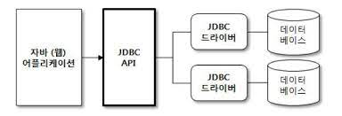
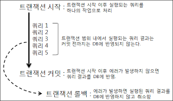
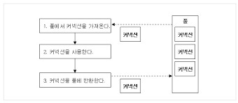

# 데이터베이스 프로그래밍
* 자바에서는 JDBC API를 이용해서 데이터베이스 프로그래밍을 한다.

## 데이터베이스 기초
* [데이터베이스 기초 참고](./database_basic.md)

## JDBC 프로그래밍
* JDBC : Java DataBase Connectivity 
* JDBC API : 자바에서 데이터베이스와 관련된 작업을 처리할 때 사용하는 API
* 자바는 DBMS의 종류에 상관 없이 하나의 JDBC API를 사용해서 데이터베이스 작업을 처리할 수 있다.
__________________________
## JDBC 구조

* 자바 어플리케이션에서 데이터베이스를 사용할 때에는 데이터베이스 종류에 상관 없이 JDBC API를 이용해서 데이터베이스에 접근한다.
* JDBC API는 JDBC 드라이버를 거쳐 데이터베이스와 통신을 한다.
* 각각의 DBMS는 자신에게 알맞은 JDBC 드라이버를 제공하고 있다.
* JDBC API를 사용하면 DBMS에 알맞은 JDBC 드라이버만 있으면 어떤 데이터베이스라도 사용할 수 있다.

### JDBC 프로그램 전형적인 실행 순서
1. JDBC 드라이버 로딩
2. 데이터베이스 커넥션 구함
3. 쿼리 실행을 위한 Statement 객체 생성
4. 쿼리 실행                     
5. 쿼리 실행 결과 사용
6. Statement 종료
7. 데이터베이스 커넥션 종료
__________________________
## PreparedStatement 쿼리를 사용하는 이유
Statement 쿼리 대신 PreparedStatement 쿼리를 사용하는 주된 이유
* 값 변환을 자동으로 하기 위해
* 간결한 코드를 위해
_____________________________
## JDBC와 트랜잭션

* 트랜잭션이 시작되면 이후로 실행되는 쿼리 결과는 DBMS에 곧바로 반영되지 않고 임시로 보관된다.
* 트랜잭션을 커밋(commit)하면 임시 보관한 모든 쿼리 결과를 실제 데이터에 반영한다.
* 트랜잭션을 커밋하기 전에 에러가 발생하면 임시로 보관한 모든 쿼리 결과를 실제 데이터에 반영하지 않고 취소한다. 이를 롤백(rollback)이라고 한다.
* 트랜잭션이 시작되면 트랜잭션 범위 내에 있는 모든 쿼리 결과가 DB에 반영되거나 또는 반영되지 않게 된다.

### 트랜잭션을 구현하는 방법
1. JDBC의 오토 커밋 모드를 false로  지정 : 단일 데이터베이스 접근 시
2. JTA(Java Transcation API)를 이용 : 두개 이상의 데이터베이스 트랜잭션 처리 시
____________________________
## 커넥션 풀


* 데이터베이스와 연결된 커넥션을 미리 만들어서 풀 속에 저장해 두고 있다가 필요할 때 커넥션 풀에서 가져다 쓰고 다시 풀에 반환하는 기법
* 커넥션 풀 기법은 풀 속에 데이터베이스와 연결된 커넥션을 미리 생성해 놓는다.
* 데이터베이스 커넥션이 필요하면 풀 속에 미리 생성된 커넥션을 가져다가 사용하고, 사용이 끝나면 커넥션을 풀에 반환
* 풀에 반환된 커넥션은 다음에 다시 사용된다.

### 커넥션 풀의 특징
* 풀 속에 미리 커넥션이 생성되어 있기 때문에 커넥션을 생성하는 데 드는 연결 시간을 줄일 수 있다. - 애플리케이션 실행 속도가 빨라짐
* 커넥션을 계속해서 재사용하기 때문에 생성되는 커넥션 수가 일정하게 유지된다. - 동시 접속자 수가 몰려도 웹 애플리케이션이 쉽게 다운되지 않는다.

_______________________________________________
## 인텔리제이 설정 시 주의
### 이미 사용하고 있는 포트가 있는지 확인하자.
* 톰캣 깔려 있는 경로에서 직접 터미널에서 톰캣을 8080포트로 실행시키고 나서 인텔리제이 상에서 톰캣을 같은 포트로 실행시키려고 하니까 원래 열려 있던 포트 기준으로 html 페이지가 띄워졌다.
* 포트 관리가 중요함을 느꼈다.


### JDBC 드라이버 로딩 안되는 문제

```java
try {
            Class.forName("com.mysql.cj.jdbc.Driver");
//        Class.forName("com.mysql.jdbc.Driver");
        } catch (Exception e) {
            System.out.println(e.getMessage());
        }
```
드라이버를 로딩하는데서 java.lang.ClassNotFoundException: com.mysql.jdbc.Driver 이런 오류가 발생했다. 
프로젝트 구조 -> 문제로 들어가서 아래 그람과 같이 하면 아주 간단하게 해결됐다.


https://honsal.blogspot.com/2016/02/intellij-idea-jdbc-driver.html 자료를 참고했다.


## 참고자료
https://wisdom-and-record.tistory.com/61
https://leirbag.tistory.com/80
