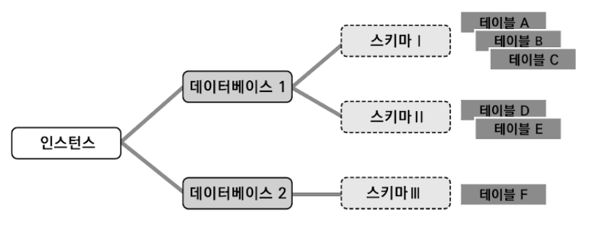
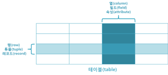

# 데이터베이스 기초

## DBMS
* DBMS(Database Management System) : 데이터베이스를 관리하는 시스템
    * 예\) 오라클, MySQL ..
* 기능
    * 데이터의 추가/조회/변경/삭제
    * 데이터의 무결성(integrit) 유지
    * 트랜잭션 관리
    * 데이터의 백업 및 복원
    * 데이터 보안

```
데이터의 무결성 : 데이터의 정확성, 일관성, 유효성이 유지되는 것
1. 정확성 : 중복이나 누락이 없는 상태
2. 일관성 : 원인과 결과의 의미가 연속적으로 보장되어 변하지 않는 상태 
```

## 테이블과 레코드




* 테이블 : RDBMS에서 데이터를 저장하는 장소
* 스키마 : 테이블의 구조와 관련된 정보

## 레코드 정렬 : 주요키(Primary Key)와 인덱스(Index)

레코드를 미리 특정 값을 이용해서 정렬해 놓으면 좀 더 빠르게 레코드를 찾을 수 있다. 이러한 방법으로 두가지 있다.
1. 주요키 칼럼 이용
    * 주요키 칼럼은 하나의 테이블에 저장된 모든 레코드가 서로 다른 값을 갖는다.
2. 인덱스 이용
    * 레코드의 특정 칼럼을 이용해서 레코드를 쉽게 찾을 수 있도록 미리 정리된 표
> 주요키도 인덱스의 일종이다. 다만 인덱스는 중복된 값에 대한 정렬이 가능하지만 주요키는 중복된 값을 가질 수 없다는 차이가 있다. 
```
데이터베이스 키의 종류
- 수퍼키(Super Key) : 유일성 O, 최소성 X
- 후보키(Candidate Key) : 유일성 O, 최소성 O
- 기본키(Primary Key) : 후보키들 중 하나를 선정하여 대표로 삼는 키, 유일성 O, 최소성 O
```

## ㄷ