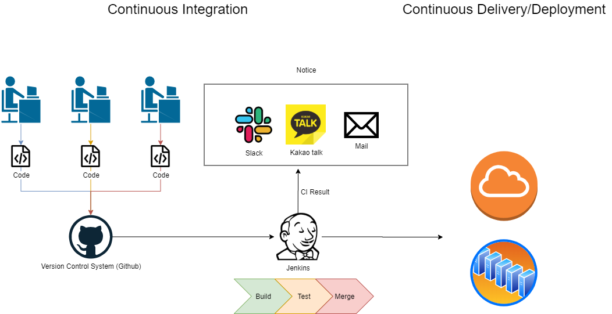
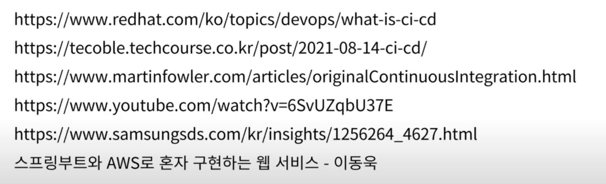

# CI/CD
## 용어 정리

* 컴파일
	* 프로그래머가 작성한 소스코드를 기계어로 변환하는 과정
* 빌드
	* 소스 코드 파일을 컴퓨터에서 실행할 수 있는 소프트웨어 산출물로 만드는 과정
* 배포
	* 빌드의 결과물을 사용자가 접근할 수 있는 환경에 배치하는 것

## CI(Continuous Integeration)
지속적 통합이라는 뜻으로 개발을 진행하면서도 품질을 관리할 수 있도록 여러 명이 하나의 코드에 대해서 수정을 진행해도 지속적으로 통합하면서 관리할 수 있음을 의미

### CI 과정

1. 개발자 코드 병합 요청 -> CI tool 빌드, 테스트 진행
2.  
	2-1. 이상이 없으면 코드 병합 
	2-2. 문제가 발생할 경우 개발자에게 피드백

### 마틴 파울러가 제시하는 CI의 4가지 규칙
* 모든 소스코드가 살아있고 누구든 현재의 소스에 접근할 수 있는 단일지점을 유지할 것
* 빌드 프로세스를 자동화해서 누구든 소스로부터 시스템을 빌드할 수 있게 할 것
* 테스팅을 자동화해서 언제든지 시스템에 대한 건전한 테스트 수트를 실행할 수 있게 할 것
* 누구든 현재 실행 파일을 얻으면 지금까지 가장 완전한 실행 파일을 얻었다는 확신을 하게 할 것

## CD(Continuous Deployment)
* 지속적 배포라는 뜻으로 빌드의 결과물을 프로덕션으로 릴리스하는 작업을 자동화하는 것을 의미한다.

## 정리
* CI
	* 고객의 요구사항에 빠르게 대응하기 위해 나온 XP의 실천방안 중 1가지
	* 여러 명이 하나의 코드에 대해서 수정을 진행해도 지속적으로 통합하면서 관리할 수 있음을 의미
* CD
	* CI의 연장선에 있는 개념
	* 빌드의 결과물을 프로덕션으로 지속적으로 배포하는 것을 의미

# 무중단 배포
## 무중단 배포 구현 방법
* AWS에서 Blue-Green 무중단 배포
* 도커를 이용한 무중단 배포
* L4, L7 스위츨 이용한 무중단 배포
* Nginx를 이용한 무중단 배포

## 관련 개념
### 리버스 프록시
* 인터넷과 서버 사이에 위치한 중계 서버
* 클라이언트가 요청한 내용을 캐싱
* 서버 정보를 클라이언트로부터 숨길 수 있어 보안에 용이

### 로드 밸런싱
* 서버에 가해지는 부하를 분산해주는 역할
* 하나의 서버가 멈추더라도 서비스 중단 없이 다른 서버가 서비스를 계속 유지할 수 있는 무중단 배포가 가능

## 무중단 배포 방식
* Rolling 배포
* Canary 배포
* Blue / Green 배포

### Rolling 배포
* 무중단 배포의 가장 기본적인 방식
* 서버를 차례대로 업데이트 시키는 방식
* 장점
	* 인스턴스를 추가하지 않아도 되서 관리가 간편

* 단점
	* 사용중인 인스턴스에 트래픽이 몰릴 수 있음
	* 구버전과 신버전의 공존으로 인한 호환성 문제

### Canary 배포
* 옛날 광부들이 유독 가스에 민감한 카나리아 새를 이용해 가스 누출 위험을 감지했던 것에서 유래
* 신버전을 소수의 사용자들에게만 배포
* 문제가 없는 것이 확인되면 점진적으로 다른 서버에 신버전 배포

* 장점
	* 문제 상황을 빠르게 감지 가능
	* A/B 테스트로 활용 가능
		* 분할 테스트 또는 버킷 테스트라고도 하는 A/B 테스트는 두 가지 콘텐츠를 비교하여 방문자/뷰어가 더 높은 관심을 보이는 버전을 확인
* 단점
	* 모니터링 관리 비용
	* 구버전과 신버전의 공존으로 인한 호환성 문제

### Blue / Green 배포
* Blue를 구버전, Green을 신버전으로 지칭
* 구버전과 동일하게 신버전의 인스턴스를 구성
* 신버전 배포 시 로드 밸런서를 통해 신버전으로만 트래픽을 전환

* 장점
	* 배포하는 속도가 빠르다.
	* 신속하게 롤백 가능
	* 남아 있는 기존 버전의 환경을 다음 배포에 재사용
* 단점
	* 시스템 자원이 2배로 필요
### 참고자료
https://www.youtube.com/watch?v=sIPU_VkrguI
https://deveric.tistory.com/106
https://www.jetbrains.com/ko-kr/teamcity/ci-cd-guide/continuous-integration-vs-delivery-vs-deployment/
