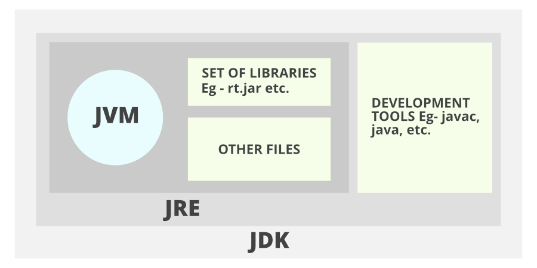
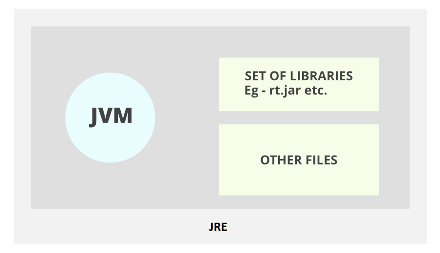
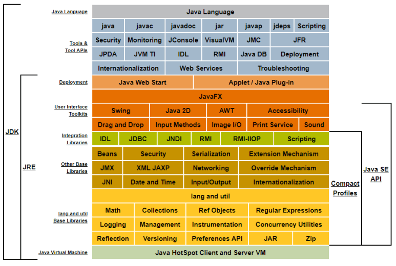

# JDK와 JRE
## JDK(Java Development Kit)

* 자바 개발 키트
* 자바 애플리케이션 개발 환경 지원
* JRE 포함, 컴파일러(javac), javadoc, jar 등 개발 도구 포함
* 자바 프로그램을 개발하기 위해선 필요

## JRE(Java Runtime Environment)

* 자바 실행 환경
* 자바 프로그램 실행 지원
* JVM 뿐만 아니라 Java binaries, Java 클래스 라이브러리 포함
* 컴파일러나 디버거(Debugger)등의 도구는 포함하지 않음
* 자바 프로그램을 개발하는 것이 아니라 실행하기 만을 원한다면 JRE 설치

## JDK와 JRE 내부 구성 - 자바 아키텍처

________________________________________
# 사용자 디렉터리 구성요소
* bin : 자바 개발, 실행에 필요한 도구와 유틸리티 명령
* conf : 여러 종류의 패치 파일
* include : 네이티브 코드 프로그래밍에 필요하는 C언어 헤더 파일
* jmods : 컴파일된 모듈 파일들
* legal : 각 모듈에 대한 저작권과 라이선스 파일
* lib : 실행 시간에 필요한 라이브러리 클래스들

## bin 디렉터리에 들어 있는 주요한 개발 소프트웨어
* javac : 자바 컴파일러로 자바 소스를 바이트 코드로 변환
* java : 자바 프로그램 실행기 → 자바 가상 기계를 작동시켜 자바 프로그램 실행
* javadoc : 자바 소스로부터 HTML 형식의 API 도큐먼트 생성
* jar : 자바 클래스 파일을 압축한 자바 아카이브 파일(.jar) 생성, 관리
* jmod : 자바의 모듈 파일(.jmd)을 만들거나 모듈 파일의 내용 출력
* jlink : 응용프로그램에 맞춘 맞춤형 JRE 생성
* jdb : 자바 응용프로그램의 실행 중 오류를 찾는 데 사용하는 디버거
* javap : 클래스 파일의 바이트 코드를 소스와 함께 보여주는 디어셈블러
________________________________________
## 참고자료
https://coding-factory.tistory.com/826 
https://code-lab1.tistory.com/253
