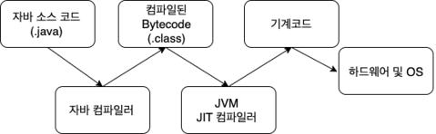

# JIT 컴파일러(just-in-time compiler)
* 동적 변환
* JRE의 구성요소

## 컴퓨터 프로그램을 실행하는 방식과 JIT
1. 인터프리트 방식 : 프로그램을 실행할 때마다 컴퓨터가 알아들을 수 있는  기계어로 변환, 간편하기는 하지만 성능이 매우 느리다.
2. 정적(static) 컴파일 방식 : 컴퓨터가 알아들을 수 있는 기계어로 변환하는 작업 수행, 변환 작업은 한번만 수행 
3. JIT는 이 두가지 방식을 혼합한 것. 변환 작업은 인터프리터에 의해 지속적으로 수행되지만, 필요한 코드의 정보는 캐시에 담아두었다가(메모리에 올려두었다가) 재사용하게 된다. 따라서 프로그램의 실행을 빠르게 하고 자바 애플리케이션의 성능을 높인다.
4. JIT를 사용하면 반복적으로 수행되는 코드는 매우 빠른 성능을 보인다는 장점이 있지만, 반대로 처음에 시작할 때에는 변환 단계를 거쳐야 하므로 성능이 느리다는 단점이 있다. 하지만 최근 들어 CPU 성능이 좋아졌고, JDK 성능 개선이 많이 이루어졌기에 단점이 많이 개선되었다.

## 지바프로그램이 수행되는 절차

1. javac 명령어를 사용하여 자바 소스코드를 class 파일로 변환한다. class 파일은 바이트 코드(bytecode)로 한 번 컴파일되서 리눅스, 맥, 윈도우 등 모든 운영체제에서 사용할 수 있다. 
> Compile once, Run anywhere
2. JVM 안에 있는 JIT 컴파일러에서 컴퓨터가 알아들을 수 있는 기계어로 변환한다.

## JIT의 작동
Java 프로그램은 클래스들로 구성되며, 이 클래스들에는 다양한 컴퓨터 아키텍처의 JVM에서 인터프리트될 수 있는 플랫폼 중립 바이트코드(class 파일)가 포함되어 있다.
런타임 때, JVM은 클래스 파일들을 로드하고 각 개별 바이트코드의 의미를 해석한 후 적절한 연산을 수행한다. 인터프리트하는 동안 프로세서와 메모리가 추가로 사용되므로 Java 애플리케이션은 바로 기계코드로 컴파일하는 애플리케이션보다 성능이 느려진다. JIT 컴파일러는 런타임에 바이트코드를 기계코드로 컴파일하여 자바 프로그램의 성능을 개선하는데 도움이 된다.

JIT 컴파일러는 기본적으로 사용가능하며 자바 메소드가 호출될 때 활성화된다. JIT 컴파일러는 해당 메소드의 바이트코드를 기계 코드로 컴파일하여 런타임 때 적시에(just in time) 컴파일한다. 메소드가 컴파일되면 JVM은 해당 메소드의 컴파일된 코드를 인터프리트하는 대신 직접 호출한다. 이론적으로 컴파일에 프로세서 시간과 메모리 사용량이 필요하지 않다면 모든 메소드를 컴파일하면 자바 프로그램의 속도가 기계코드로 컴파일하는 애플리케이션의 속도에 근접할 수 있다.

JIT 컴파일에는 프로세서와 메모리 사용이 필요하다. JVM이 처음 시작되면 수천 개의 메소드가 호출된다. 이러한 메소드를 모두 컴파일하면 프로그램이 나중에는 좋은 성능을 낼 수 있으나 프로그램의 시작 시간에는 상당한 영향을 미칠 수 있다.

## 참고자료
* 자바의 신
* https://aboullaite.me/understanding-jit-compiler-just-in-time-compiler/
