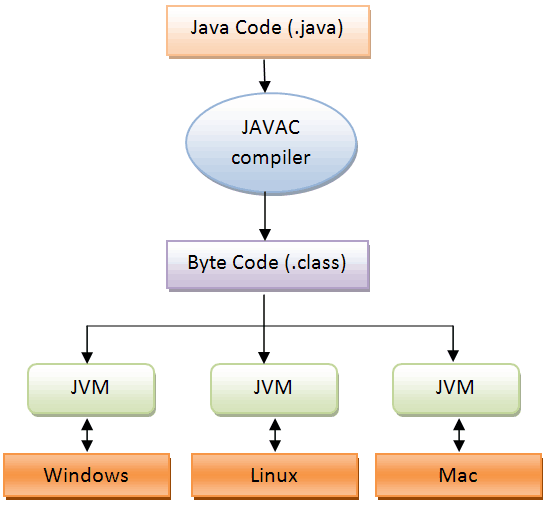

# JVM 구조
## JVM(Java Virtual Machine)이란?
* 자바와 운영체제 사이에서 중개자 역할 수행
* 자바가 운영체제에 구애받지 않고 프로그램을 실행할 수 있도록 도와준다.
* 가비지 컬렉터를 통한 메모리 관리를 자동으로 수행
____________________________
## 자바 프로그램 실행 단계

1. 자바 컴파일러에 의해 자바 소스 코드는 바이트 코드로 변환
2. 이러한 바이트 코드를 JVM에서 읽어 들인 다음, 어떤 운영체제제에서든 프로그램을 실행할 수 있도록 만든다.
> 만약, 자바 소스 파일은 리눅스에서 만들었고 윈도우에서 이 파일을 실행하고 싶다면, 윈도우용 JVM을 설치만 하면 된다. 여기서 JVM은 운영체제에 종속적이라는 특징을 알 수 있다.
_____________________________
## JVM 메모리 구조
* JVM 구조
    * 가비지 컬렉터(Garbage Collector)
    * Execution Engine
    * 클래스 로더(Class Loader)
    * 런타임 데이터 영역(Runtime Data Area)
    

___________________________
## 참고자료
https://steady-coding.tistory.com/305
