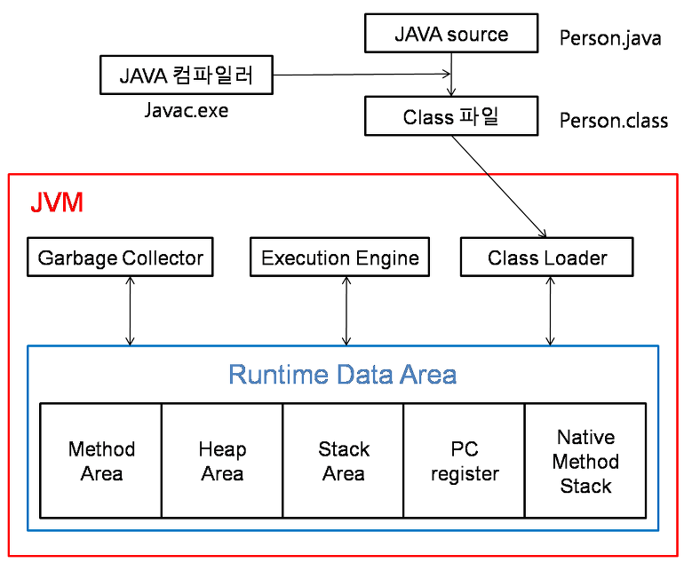
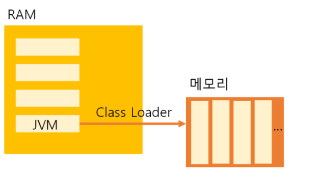
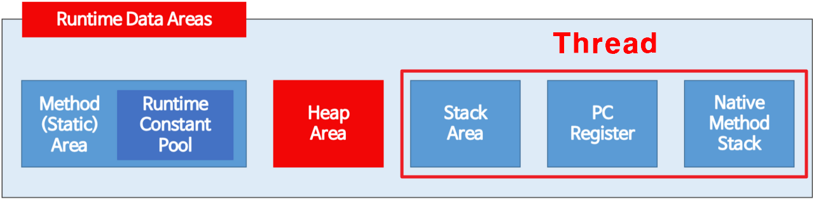
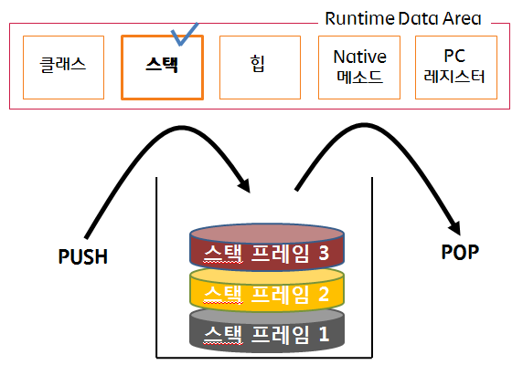

# JVM 구조
## JVM(Java Virtual Machine)이란?
* 자바와 운영체제 사이에서 중개자 역할 수행
* 자바가 운영체제에 구애받지 않고 프로그램을 실행할 수 있도록 도와준다.
* 가비지 컬렉터를 통한 메모리 관리를 자동으로 수행
____________________________
## JVM의 동작 방식

1. 자바로 개발된 프로그램을 실행하면 JVM은 운영체제로부터 메모리를 할당한다.
2. 자바 컴파일러(javac)가 자바 소스코드\(.java\)를 \(.class\)로 컴파일한다.
3. Class Loader를 통해 JVM Runtime Data Area로 로딩한다.
4. Runtime Data Area에 로딩된 .class들을 Execution Engine을 통해 해석한다.
5. 해석된 바이트 코드는 Runtime Data Area의 각 영역에 배치되어 수행하며 이 과정에서 Execution Engine에 의해 GC의 작동과 스레드 동기화가 이루어진다.

> 바이트 코드를 JVM에서 읽어 들인 다음, 어떤 운영체제제에서든 프로그램을 실행할 수 있도록 만든다. 만약, 자바 소스 파일은 리눅스에서 만들었고 윈도우에서 이 파일을 실행하고 싶다면, 윈도우용 JVM을 설치만 하면 된다. 여기서 JVM은 운영체제에 종속적이라는 특징을 알 수 있다.

## JVM의 구조
* 클래스 로더(Class Loader)

자바는 동적으로 클래스를 읽어오므로, 프로그램이 실행 중인 런타임에서야 모든 코드가 자바 가상 머신과 연결된다. 이렇게 동적으로 클래스를 로딩해주는 역할을 하는 것이 바로 클래스 로더(class loader)이다. 자바에서 소스코드를 작성하면 .java파일이 생성되고 .java소스를 컴파일러가 컴파일하면 .class파일이 생성되는데 클래스 로더는 .class 파일을 묶어서 JVM이 운영체제로부터 할당받은 메모리 영역인 Runtime Data Area 그중에서도 메소로 영역(Method Area)로 적재한다.

* 실행 엔진(Execution Engine) 
클래스 로더에 의해 JVM으로 로드된 .class 파일(바이트코드)들은 Runtime Data Area의 메소드 영역에 배치되는데, 배치된 이후에 JVM은 메소드 영역의 바이트 코드를 실행 엔진(Execution Engine)에 제공하여, 정의된 내용대로 바이트 코드를 실행시킨다. 실행 엔진은 바이트코드를 명령어 단위로 읽어서 실행한다.
> 최초 JVM이 나왔을 당시에는 인터프리터 방식이었기때문에 속도가 느리다는 단점이 있었지만 JIT 컴파일러 방식을 통해 이 점을 보완하였다. JIT는 바이트 코드를 어셈블러 같은 네이티브 코드로 바꿈으로써 실행이 빠르지만 역시 변환하는데 비용이 발생하였다. 이 같은 이유로 JVM은 모든 코드를 JIT 컴파일러 방식으로 실행하지 않고, 인터프리터 방식을 사용하다가 일정한 기준이 넘어가면 JIT 컴파일러 방식으로 실행한다.

* 가비지 컬렉터(Garbage Collector) 
JVM은 가비지 컬렉터(garbage collector)를 이용하여 사용하지 않는 메모리를 자동으로 해제한다. 힙 영역에 생성된 객체들 중에 참조되지 않은 객체들을 탐색 후 제거하는 역할을 한다.
[가비지 컬렉터](./garbageCollector.md)

* 런타임 데이터 영역 (Runtime Data Area)

1. 메서드 영역(Method Area)
모든 스레드가 공유해서 사용 
메소드 영역은 클래스, 인터페이스, 메소드, 필드, Static 변수 등의 바이트 코드를 보관

2. 힙 영역(Heap Area)
모든 스레드가 공유해서 사용 
new 키워드로 생성된 객체와 배열이 생성되는 영역 
주기적으로 GC가 제거하는 영역

3. 스택 영역 (Stack Area)

지역변수, 파라미터, 리턴 값, 연산에 사용되는 임시 값 등이 생성되는 영역 
메소드 호출 시마다 각각의 스택 프레임(그 메소드만을 위한 공간)이 생성한다. 그리고 메소드 안에서 사용되는 값들을 저장하고, 호출된 메소드의 매개변수, 지역변수, 리턴 값 및 연산 시 일어나는 값들을 임시로 저장한다. 마지막으로, 메서드 수행이 끝나면 프레임별로 삭제한다.

4. PC 레지스터 (PC Register)
Thread가 생성될 때마다 생성되는 영역 
프로그램 카운터, 즉 현재 스레드가 실행되는 부분의 주소와 명령을 저장하고 있는 영역

5. 네이티브 메서드 스택 (Native Method Stack)
자바 이외의 언어(C, C++, 어셈블리 등)로 작성된 네이티브 코드를 실행할 때 사용되는 메모리 영역

___________________________
## 참고자료
https://steady-coding.tistory.com/305 
https://coding-factory.tistory.com/828 
https://docs.oracle.com/javase/specs/jvms/se11/html/jvms-2.html#jvms-2.5.3
