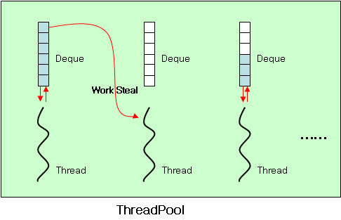

# Java 7에서의 변화
* Java 7 변화는 JSR 336이라는 문서에 정리

## Java 7 대표 변경사항 
* 숫자 표시 방법 보완
* switch 문에서 String 사용
* 제네릭 생성자에 타입 명시하지 않아도 가능
* 예외 처리 시 다중 처리 가능

## Java 7 추가사항
* Fork/Join
* NIO2
* Files

[변경사항]
### 숫자 표시 방법 보완
```java
int decVal = 1106; //10진법
int octVal = 02112; //8진법
int hexVal = 0x452; //16진법
int binaryVal = 0b10001010010; //2진법 : Java 7 추가
```
```java
int million = 1_000_000;
```
### switch 문에서 String 사용

### 제네릭 생성자에 타입 명시하지 않아도 가능
```java
HashMap<String, Integer> map = new HashMap<>();//다이아몬드
```
* 생성자에 있는 new와 클래스 이름 사이ㅔ 타입 이름을 명시적으로 두려면, 다이아몬드를 사용하면 안된다.

### 예외 처리 시 다중 처리 가능
* 각 Exception을 조건식에서 or를 나타내는 파이프(|)로 연결하여 처리 가능
```java
    public void scanFile(String fileName, String encoding) {
        Scanner scanner = null;
        try {
            scanner = new Scanner(new File(fileName), encoding);
            System.out.println(scanner.nextLine());
        } catch (IllegalArgumentException | FileNotFoundException | NullPointerException exception ) {
            exception.printStackTrace();
        } finally {
            if (scanner != null) {
                scanner.close();
            }
        }
    }
```
* try-with-resource
	* AutoCloseable 인터페이스 추가
	* AutoCloseable을 구현한 클래스는 별도로 close()를 호출할 필요가 없다.
```java
    public void scanFile(String fileName, String encoding) {
        Scanner scanner = null;
        try {
            scanner = new Scanner(new File(fileName), encoding);
            System.out.println(scanner.nextLine());
        } catch (IllegalArgumentException | FileNotFoundException | NullPointerException exception ) {
            exception.printStackTrace();
        }
    }
```

[추가사항]
### Fork/Join
* Fork/Join : 어떤 계산 작업을 할 때 여러 개로 나우어 계산한 후 결과를 모으는 작업
	* Fork : 여러 개로 나누는 것
	* Join : 나누어서 작업한 결과를 모으는 것
* Work stealing 개념 포함
	* Work stealing은 자료구조 Dequeue과 관련이 있다.
	* 각 쓰레드가 처리되지 않은 작업들을 할당 받은 상태에서 한 쓰레드에 작업이 많이 할당되어 바쁜 상태라면 현재 처리하고 있는 작업이 없어 여유로운 쓰레드가 바쁜 쓰레드의 작업을 가져가서 대신 해준다.
	* Fork/Join을 사용하면 별도로 구현하지 않아도 해당 라이브러리에서 Work steal 작업을 알아서 수행한다.


### NIO2
* 파일의 속성을 다룰 수 있으며, 심볼릭 링링크크까까지 처리할 수 있있는  기기능  제제공공
* WatchService 제공 : 파일 변경을 쉽게 확인

* File 클래스의 단점(Java 6까지 사용됨)
    * 심볼릭 링크, 속성, 파일의 권한 등에 대한 기능이 없음
    * 파일을 삭제하는 delete() 메소드는 실패시 아무런 예외를 발생시키지 않고, boolean 타입의 결과만 제공해 줌
    * 파일이 변경되었는지 확인하는 방법은 lastModified()라는 메소드에서 제공해주는 long 타입의 결과로 이전 시간과 비교하는 수밖에 없었으며, 이 메소드가 호출되면 연계되어 호출되는 클래스가 다수 존재하며 성능상 문제도 많음

* NIO2에서 File클래스를 대체하는 클래스

| 클래스 | 설명 |
| ---- | ---------------------------------------- |
| Paths | 이 클래스에서 제공하는 static한 get() 메소드를 사용하면 Path라는 인터페이스의 객체를 얻을 수 있다. 여기서 Path라는 인터페이스는 파일과 경로에 대한 정보를 갖고 있다. |
| Files | 기존 File 클래스에서 제공되던 클래스의 단점들을 보완한 클래스다. 매우 많은 메소드를 제공하며, Path 객체를 사용하여 파일을 통제하는데 사용된다. |
| FileSystems | 현재 사용중인 파일 시스템에 대한 정보를 처리하는데 필요한 메소드를 제공한다. Paths와 마찬가지로 이 클래스에서 제공되는 static한 getDefault() 메소드를 사용하면 현재 사용중인 기본 파일 시스템에 대한 정보를 갖고 있는 FileSystem이라는 인터페이스의 객채를 얻을 수 있다. |
| FileStore | 파일을 저장하는 디바이스, 파티션, 볼륨 등에 대한 정보들을 확인하는 데 필요한 메소드를 제공한다. |

