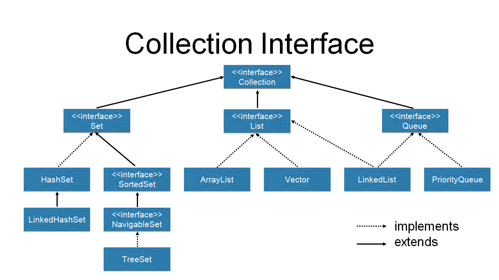
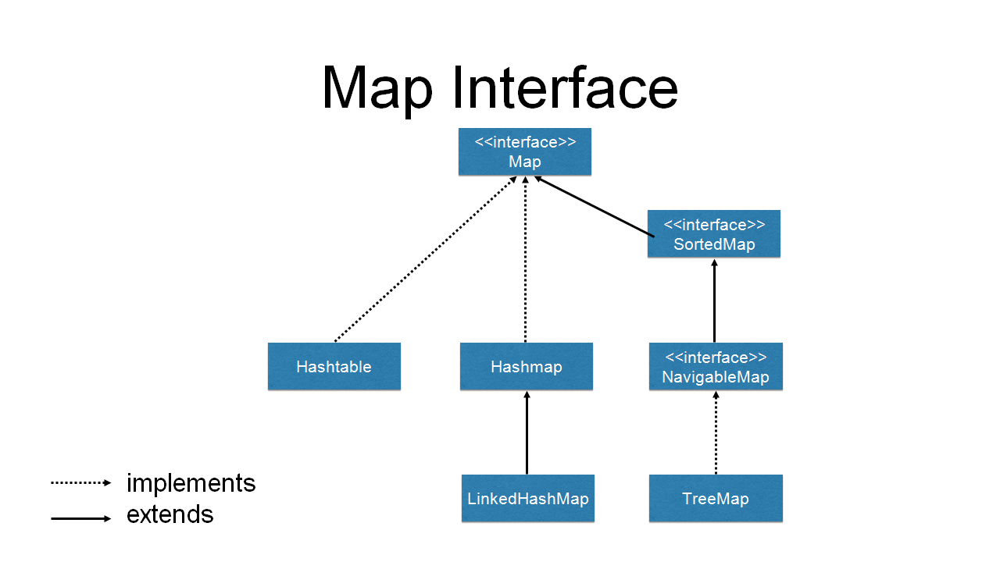
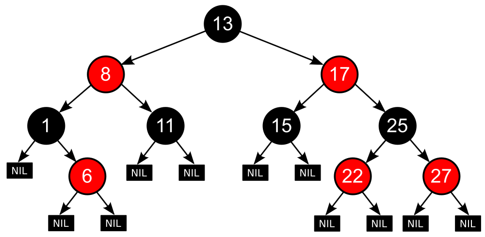
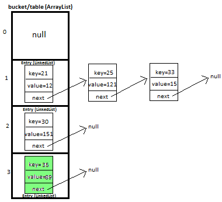

# 자바 컬렉션
## 자료구조의 분류
* 순서가 있는 목록(List) 형
* 순서가 중요하지 않는 셋(Set) 형
* 먼저 들어온 것이 먼저 나가는 큐(Queue) 형
* 키-값(key-value)으로 저장되는 맵(Map) 형
- 컬렉션 인터페이스

- 맵 인터페이스

## 컬렉션 인터페이스의 선언부
```java
public interface Collection<E> extends Iterablee<E>
```
Collection 인터페이스가 Iterable 인터페이스를 확장했다는 의미는 Iterator 인터페이스를 사용하여 데이터를 순차적으로 가져올 수 있다는 의미이다.

# List
* 순서가 있다.
* ArrayList : Thread safe 하지 않음
* Vector : Thread safe
* Stack은 Vector를 확장
## ArrayList
### ArrayList가 구현한 인터페이스
| 인터페이스 | 용도 |
| --------- | ------------- |
| Serializable | 원격으로 객체를 전송하거나, 파일에 저장할 수 있음을 지정 |
| Clonable | Object의 클래스의 clone() 메소드가 제대로 수행될 수 있음을 지정 |
| Iterable\<E> | 객체가 foreach 문장을 사용할 수 있음을 지정
| Collection\<E> | 여러 개의 객체를 하나의 객체에 담아 처리할 때의 메소드 지정 |
| List\<E> | 목록형 데이터를 처리하는 것과 관련된 메소드 지정
| RandomAccess | 목록형 데이터에 보다 빠르게 접근할 수 있도록 임의로 접근하는 알고리즘이 적용된다는 것을 지정 |
### ArrayList 생성자
제네릭을 사용해서 선언할 것을 권장
```java
ArrayList<String> list1 = new ArrayList<String>();
```
JDK 7부터는 아래와 같이 작성 가능
```java
ArrayList<String> list1 = new ArrayList<>();
```
### 얕은 복사(Shallow copy) VS 깊은 복사(Deep copy)
* 얕은 복사 : 다른 객체에 원본 객체의 주소값만을 할당하는 것
* 깊은 복사 : 객체의 모든 값을 복사, 복제된 객체에 있는 값을 변경해도 원본에 영향이 없음

### Thread safe 하게 만들기
* ArrayList는 Thread safe 하지 않음
* 멀티쓰레드 환경에서 안전하게 만들려면 다음과 같이 객체를 생성해야 한다.
```java
List list = Collections.synchronized(new ArrayList(...));
```

### Stack
* LIFO(Last In First Out) 후입선출
* Thread safe 
* 이와 유사한 클래스로 ArrayDeque라는 클래스가 있음. 성능은 더 빠르나 Thread safe 하지 않음

# Set
* 데이터의 중복을 허용하지 않음
* 
## Set 인터페이스를 구현한 주요 클래스
* HashSet : 순서가 전혀 필요 없는 데이터를 해시 테이블(hash table)에 저장한다. Set 중에 가장 성능이 좋다.
* TreeSet : 저장된 데이터의 값에 따라 정렬되는 셋이다. red-black이라는 트리 타입으로 값이 저장되며, HashSet 보다 약간 성능이 느리다.
* LinkedHashSet : 연결된 목록 타입으로 구현된 해시 테이블에 데이터를 저장한다. 저장된 순서에 따라서 값이 정렬된다. 대신 성능이 셋중에서 가장 나쁘다. 
* 성능 차이가 발생하는 이유는 데이터 정렬 때문이다. 

<hr/>
red-black 트리


레드-블랙 트리는 각각의 노드가 레드 나 블랙 인 색상 속성을 가지고 있는 이진 탐색 트리이다. 이진 탐색 트리가 가지고 있는 일반적인 조건에 다음과 같은 추가적인 조건을 만족해야 유효한(valid) 레드-블랙 트리가 된다:[1]

1. 노드는 레드 혹은 블랙 중의 하나이다.
2. 루트 노드는 블랙이다.
3. 모든 리프 노드들(NIL)은 블랙이다.
4. 레드 노드의 자식노드 양쪽은 언제나 모두 블랙이다. (즉, 레드 노드는 연달아 나타날 수 없으며, 블랙 노드만이 레드 노드의 부모 노드가 될 수 있다)
5. 어떤 노드로부터 시작되어 그에 속한 하위 리프 노드에 도달하는 모든 경로에는 리프 노드를 제외하면 모두 같은 개수의 블랙 노드가 있다.
https://ko.wikipedia.org/wiki/%EB%A0%88%EB%93%9C-%EB%B8%94%EB%9E%99_%ED%8A%B8%EB%A6%AC#:~:text=%EB%A0%88%EB%93%9C%2D%EB%B8%94%EB%9E%99%20%ED%8A%B8%EB%A6%AC%EB%8A%94%20%EA%B0%81%EA%B0%81%EC%9D%98,%EB%A3%A8%ED%8A%B8%20%EB%85%B8%EB%93%9C%EB%8A%94%20%EB%B8%94%EB%9E%99%EC%9D%B4%EB%8B%A4.

**심화 주제 같아서 책 끝까지 보고 나중에 공부..**
<hr/>

## HashSet
### HashSet이 구현한 인터페이스
| 인터페이스 | 용도 |
| --------- | ------------- |
| Serializable | 원격으로 객체를 전송하거나, 파일에 저장할 수 있음을 지정 |
| Clonable | Object의 클래스의 clone() 메소드가 제대로 수행될 수 있음을 지정 |
| Iterable\<E> | 객체가 foreach 문장을 사용할 수 있음을 지정
| Collection\<E> | 여러 개의 객체를 하나의 객체에 담아 처리할 때의 메소드 지정 |
| Set\<E> | 셋 데이터를 처리하는 것과 관련된 메소드 지정

### HashSet 생성자
| 생성자 | 설명 |
| --------- | ------------- |
| HashSet() | 데이터를 저장할 수 있는 16개의 공간과 0.75의 로드 팩터(load factor)를 갖는 객체를 생성한다. |
* 로트 팩터(load factor) : 데이터 개수 / 저장공간
* 데이터의 개수가 증가하여 로드팩터보다 커지면, 저장공간의 크기는 증가되고 해시 재정리 작업을 해야 한다. 데이터가 해시 재정리 작업에 들어가면, 내부에 갖고 있는 자료구조를 다시 생성하는 단계를 거쳐야 하므로 성능에 영향이 발생한다.
* 로드 팩터라는 값이 클수록 공간은 넉넉해지지만, 데이터를 찾는 시간은 증가한다.

# Queue
* FIFO(First In First Out) : 선입선출
* 여러 쓰레드에서 들어오는 작업을 순차적으로 처리할 때 사용
## LinkedList로 Queue를 구현하는 이유
* 배열의 중간에 있는 데이터가 지속적으로 삭제되고, 추가될 경우에는 LinkedList가 배열보다 메모리 공간 측면에서 훨씬 유리하다.
	* 배열을 이용하는 ArrayList와 Vector의 경우에 특정 값을 삭제하면 그 값 뒤에 있는 값들은 하나씩 앞으로 이동해야 한다.
	* LinkedList는 중간에 있는 데이터를 삭제하면 지운 데이터의 앞에 있는 데이터와 뒤에 있는 데이터를 연결하면 된다.
## Queue 이용 사례
* 웹서버나 WAS(Web Application Server) 등과 같이 사용자의 요청을 처리할 때 
## LinkedList
### LinkedList가 구현한 인터페이스
| 인터페이스 | 용도 |
| --------- | ------------- |
| Serializable | 원격으로 객체를 전송하거나, 파일에 저장할 수 있음을 지정 |
| Clonable | Object의 클래스의 clone() 메소드가 제대로 수행될 수 있음을 지정 |
| Iterable\<E> | 객체가 foreach 문장을 사용할 수 있음을 지정
| Collection\<E> | 여러 개의 객체를 하나의 객체에 담아 처리할 때의 메소드 지정 |
| Deque\<E> | 맨 앞과 맨 뒤의 값을 용이하게 처리하는 큐와 관련된 메소드 지정 |
| List\<E> | 목록형 데이터를 처리하는 것과 관련된 메소드 지정 |
| Queue\<E> | 큐를 처리하는 것과 관련된 메소드 지정 |

# Map
* Map은 키와 값으로 이루어져 있다.
* 데이터의 추가 순서는 중요하지 않음
## Map을 구현한 주요 클래스
* Map 인터페이스를 구현한 클래스 : HashMap, TreeMap, LinkedHashMap, Hashtable
## HashMap, TreeMap, LinkedHashMap와 Hashtable 차이
* Map은 컬렉션 (Collection view)를 사용하지만, Hashtable은 Enumeration 객체를 통해서 데이터를 처리한다.
* Map은 키, 값, 키-값 쌍으로 데이터를 순환하여 처리할 수 있지만, Hashtable은 이 중에서 키-값 쌍으로 데이터를 순환하여 처리할 수 없다.
* Map은 이터레이션을 처리하는 도중에 데이터를 삭제하는 안전한 방법을 제공하지만, Hashtable은 그러한 기능을 제공하지 않는다.

| 기능 | HashMap | Hashtable |
| --------- | ------------- | -----------------|
| 키나 값에 null 저장 가능 여부 | 가능 | 불가능 |
|여러 쓰레드 안전 여부 | 불가능 | 가능 |

https://hee96-story.tistory.com/48

## HashMap
### HashMap이 구현한 인터페이스
| 인터페이스 | 용도 |
| --------- | ------------- |
| Serializable | 원격으로 객체를 전송하거나, 파일에 저장할 수 있음을 지정 |
| Clonable | Object의 클래스의 clone() 메소드가 제대로 수행될 수 있음을 지정. 즉, 복제가 가능한 객체임을 의미 |
| Map\<E> | 맵의 기본 메소드 지정 |
* 직접 어떤 클래스를 만들어 그 클래스를 키로 사용할 때에는 Object 클래스의 hashCode() 메소드와 equals() 메소드를 잘 구현해 놓아야만 한다.
* HashMap에 객체가 들어가면 hashCode() 메소드의 결과 값에 따른 버켓이라는 목록 형태의 바구니가 만들어진다. 만약 서로 다른 키가 저장되었는데, hashCode() 메소드의 결과가 동일하다면, 이 버켓에 여러 개의 값이 들어갈 수 있다.

[java map buckets]



* 참고 : [해시](./hash.md) 