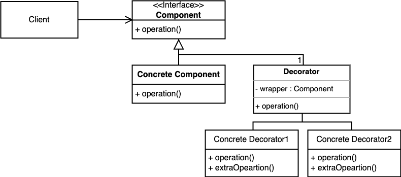

# item 18 상속보다는 컴포지션을 사용하라

## 들어가기 전 참고사항
* 여기서 상속은 클래스가 다른 클래스를 확장하는 구현 상속을 말한다. 
    * 클래스가 인터페이스를 구현하거나 인터페이스가 다른 인터페이스를 확장하는 인터페이스 상속과는 무관하다.

## 상속의 문제점
* 메소드 호출과 달리 상속은 캡슐화를 깨뜨린다.
    * 상위 클래스가 어떻께 구현되느냐에 따라 하위 클래스의 동작에 이상이 생길 수 있다.
    * 상위 클래스는 릴리스마다 내부 구현이 달라질 수 있으며, 그 여파로 건드리지 않은 하위 클래스가 오작동할 수 있다.
### 예시 코드
```java
// 코드 18-1 잘못된 예 - 상속을 잘못 사용함 (pg114)
public class InstrumentedHashSet<E> extends HashSet<E> {
    // 추가된 원소의 수
    private int addCount = 0;

    public InstrumentedHashSet() {
    }

    public InstrumentedHashSet(int initCap, float loadFactor) {
        super(initCap, loadFactor);
    }

    @Override public boolean add(E e) {
        addCount++;
        return super.add(e);
    }

    @Override public boolean addAll(Collection<? extends E> c) {
        addCount += c.size();
        return super.addAll(c);
    }

    public int getAddCount() {
        return addCount;
    }

    public static void main(String[] args) {
        InstrumentedHashSet<String> s = new InstrumentedHashSet<>();
        s.addAll(List.of("틱", "탁탁", "펑"));
        System.out.println(s.getAddCount());
    }
}
```
1. HashSet의 addAll 내부 구현이 바뀐다면 하위클래스의 내부 구현도 바뀌어야 한다는 문제점이 있다. 즉, 캡슐화가 제대로 안되어 있다는 뜻이다.
2. 나중에 상위 클래스의 기능이 추가된다면 하위클래스에서 그 기능을 다시 오버라이딩 해줘야 한다. 또한 상위클래스에서 기능이 추가되었다는 것도 알기 어렵다.
3. 하위클래스에서 새로운 메소드를 따로 정의하는 것도 문제가 될 수 있다. 나중에 상위클래스에서 새로운 메소드와 같은 메소드를 정의하고 접근제어자의 접근 권한이 확장했을 때 오류가 나기 때문이다.

## 상속의 대안 : 컴포지션과 전달
* 컴포지션(composition, 구성) : 기존 클래스가 새로운 클래스의 구성요소로 쓰이는 설계
    * 새로운 클래스를 만들고 private 필드로 기존 클래스의 인스턴스를 참조
* 전달(forwarding) : private 필드(인스턴스 변수, 클래스 변수)를 참조하는 새 클래스의 인스턴스 메소드들은 기존 클래스에 대응하는 메소드를 호출해 그 결과를 반환한다.
* 전달 메소드(forwarding method) : 새 클래스의 전달 메소드
* 기존 클래스의 구현이 바뀌거나, 새로운 메소드가 생기더라도 아무런 영향을 받지 않는다.

### 예시코드
```java
// 코드 18-3 재사용할 수 있는 전달 클래스 (118쪽)
/*
데코레이터 패턴 : Set - Component
ForwardingSet - Decorator
*/
public class ForwardingSet<E> implements Set<E> {
    private final Set<E> s;
    public ForwardingSet(Set<E> s) { this.s = s; }

    public void clear()               { s.clear();            }
    public boolean contains(Object o) { return s.contains(o); }
    public boolean isEmpty()          { return s.isEmpty();   }
    public int size()                 { return s.size();      }
    public Iterator<E> iterator()     { return s.iterator();  }
    public boolean add(E e)           { return s.add(e);      }
    public boolean remove(Object o)   { return s.remove(o);   }
    public boolean containsAll(Collection<?> c)
                                   { return s.containsAll(c); }
    public boolean addAll(Collection<? extends E> c)
                                   { return s.addAll(c);      }
    public boolean removeAll(Collection<?> c)
                                   { return s.removeAll(c);   }
    public boolean retainAll(Collection<?> c)
                                   { return s.retainAll(c);   }
    public Object[] toArray()          { return s.toArray();  }
    public <T> T[] toArray(T[] a)      { return s.toArray(a); }
    @Override public boolean equals(Object o)
                                       { return s.equals(o);  }
    @Override public int hashCode()    { return s.hashCode(); }
    @Override public String toString() { return s.toString(); }
}
```
```java
// 코드 18-2 래퍼 클래스 - 상속 대신 컴포지션을 사용(117-118쪽)
public class InstrumentedSet<E> extends ForwardingSet<E> {
    private int addCount = 0;

    public InstrumentedSet(Set<E> s) {
        super(s);
    }

    @Override public boolean add(E e) {
        addCount++;
        return super.add(e);
    }
    @Override public boolean addAll(Collection<? extends E> c) {
        addCount += c.size();
        return super.addAll(c);
    }
    public int getAddCount() {
        return addCount;
    }

    public static void main(String[] args) {
        InstrumentedSet<String> s = new InstrumentedSet<>(new HashSet<>());//데코레이터 패턴 - concrete component
        s.addAll(List.of("틱", "탁탁", "펑"));
        System.out.println(s.getAddCount());
    }
}
```
* 다른 Set 인스턴스를 감싸고 있다는 뜻에서 InstrumentedSet 클래스를 래퍼클래스라고 한다.
* addAll 메소드에서 부수효과가 사라진 것을 볼 수 있다.
* 전달 클래스에서 Set이라는 인터페이스 규격에 맞춰 구현을 할 것이기 때문에 Set의 내부 구현이 어떻든 상관 없다. 따라서 캡슐화가 됨을 알 수 있다. 
* HashSet에 메소드가 추가되도 상관이 없다. 생성자의 매개변수에는 Set만 들어가기 때문에 전달클래스의 코드는 바뀌지 않는다.
* 다만 인터페이스 Set에 메소드가 추가된다면 전달클래스는 알아차릴 수 밖에 없다. 구현하지 않은 메소드가 생기기 때문이다.
* 래퍼 클래스에서 새로운 메소드가 추가되도 안전하다.

## 데코레이터 패턴 
* 디자인 패턴 중 하나 
* 기존 코드를 변경하지 않고 부가 기능을 추가하는 패턴
* 상속이 아닌 위임을 사용해서 보다 유연하게(런타임에) 부가기능을 추가하는 것도 가능하다.

