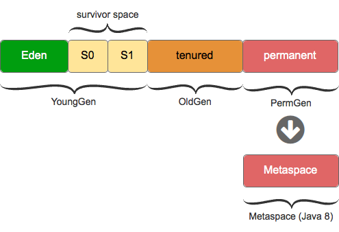
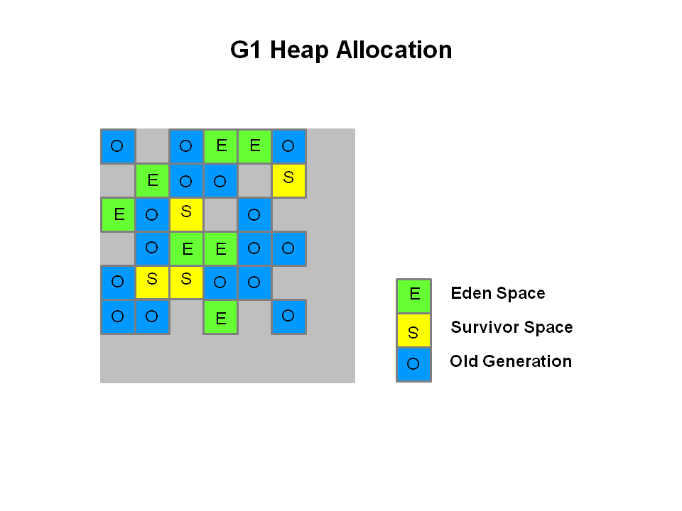
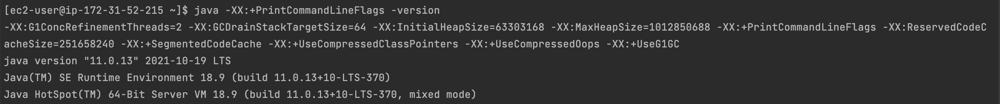
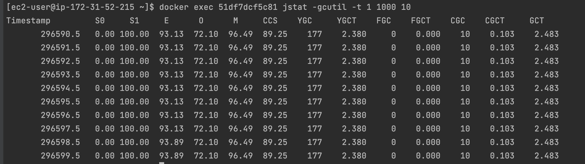
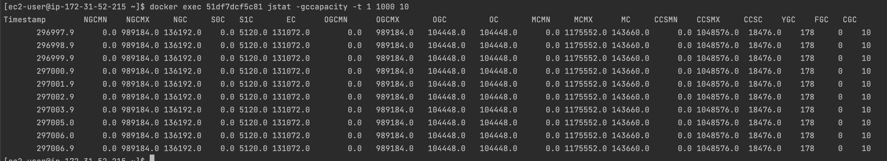

# Garbage Collector
## GarbageCollector란?
* JVM 내에서 메모리 관리를 해준다.
* 동적으로 할당된 메모리 영역 중 사용하지 않은 영역을 탐지하여 해제
> [Stack, Heap] <br>- Stack : 정적으로 할당한 메모리 영역 <br> 원시 타입의 데이터가 값과 함께 할당<br>Heap 영역에 생성된 Object 타입의 데이터의 참조값 할당<br><br>- Heap : 동적으로 할당한 메모리 영역<br> 모든 Object 타입의 데이터가 할당, Heap영역의 Object를 가리키는 참조 변수가 Stack에 할당

_____________________________________________________
## Garbage Collector 과정 - Mark and Sweep
### \[ Mark \]
1. Garbage collector가 Stack의 모든 변수를 스캔하면서 각각 어떤 객체를 참조하고 있는지 찾아서 마킹한다.
2. Reachable Object가 참조하고 있는 객체도 찾아서 마킹한다.
### \[ Sweep \]
3. 마킹되지 않은 객체를 Heap에서 제거한다.
____________________________________________
## GC가 일어나는 시기


* Young Generation : 새로운 객체들이 할당되는 영역
* Old Generation : Young Generation에서 오랫동안 살아남은 객체들이 존재하는 영역
* Metaspace : 가비지 컬렉션 시에 필요한 클래스와 메소드의 요약 정보가 존재하는 영역

1. 새로운 객체가 Eden 영역에 할당된다.
2. Eden 영역에 할당될 공간이 없으면 Minor GC가 발생한다. -> Mark and Sweep 과정
3. 여기서 reachable 객체들은 survivor 영역으로 이동 (Survivor 0 또는 Survivor 1은 무조건 비워져야 한다.)
4. Survivor 영역에 있는 객체들은 age 값이 증가한다.
5. 이러한 과정이 계속 반복되다가 객체의 age 값이 특정 임계점에 도달하게 되면 Old generation으로 이동(promoted)
6. Old generation이 꽉 차게 되면 Major GC 발생


_______________________________________

## Garbage Collector 종류
1. Serial GC
2. Parallel GC
3. Concurrent Mark Sweep GC
4. G1 GC

> Stop-The-World<br>
    - GC를 실행하기 위해 JVM이 애플리케이션 실행을 멈추는 것<br>
    - stop-the-world가 발생하면 GC를 실행하는 쓰레드를 제외한 나머지 쓰레드는 모두 작업을 멈춘다.<br>
    - GC 작업을 완료한 이후에 중단한 작업을 다시 시작한다.

### 1. Serial GC
* GC를 처리하는 쓰레드가 1개
* 다른 GC에 비해 stop-the-world 시간이 길다.
* CPU 코어가 1개만 있을 때 사용하는 방식
* Mark-Compact collection 알고리즘 사용


* Mark와 Sweep의 단계는 이전 Mark-and-Sweep Algorithm과 동일하나 Compact 과정을 한 단계 더 거치게 된다.
* Compaction 작업은 Sweep 이후 Garbage였던 Object들이 사라지고 남은 빈자리들을 살아남은 Object들로 연속된 메모리 공간에 차곡차곡 적재하는 것을 의미한다. 
* Compaction 작업을 통해 메모리 공간의 효율을 높일 수 있다. 
* 하지만 Compaction 작업 이후 살아남은 모든 Object들의 Reference를 업데이트하는 작업이 필요하기 때문에 부가적인 Overhead가 수반된다.
### 2. Parallel GC
* Java 8의 defualt GC
* Young 영역의 GC를 처리하는 쓰레드가 여러개
* Serial GC보다 stop-the-world 시간이 감소하고 빠르게 객체를 처리할 수 있다.
* Parallel GC는 메모리가 충분하고 코어의 개수가 많을 때 사용하면 좋다.

### 3. Parallel Old GC
* Parallel GC를 개선
* Old 영역에서도 멀티 쓰레드 방식의 GC 수행
* Mark-Summary-Compact 알고리즘 사용
    * sweep : 단일 쓰레드가 old 영역 전체를 훑는다.
    * summary : 멀티 쓰레드가 old 영역을 분리해서 훑는다.

### 3. Concurrent Mark Sweep GC (CMS GC)
* stop-the-world 시간이 짧다.
* GC를 처리하는 쓰레드는 하나지만 나머지 쓰레드들은 작업을 계속 진행
* reachable 객체를 한번에 찾지 않고 순차적으로 찾는다.
* 애플리케이션의 응답 시간이 빨라야 할 때 CMS GC를 사용한다.
* 다른 GC 방식보다 메모리와 CPU를 더 많이 사용한다.
* Compaction 단계가 제공되지 않는다. - 메모리 단편화가 되지 않는다는 단점이 있음

### 4. G1 GC(Garbage First)
* CMS GC를 개선
* Java 9부터 default GC가 되었다.
* Heap 영역을 일정한 크기의 Region 영역으로 나눈다.
* GC가 일어날 때, 전체 영역(Eden, Survival, Old generation)이 아닌 Region 단위로 탐색한다.
* compact 진행


* 다음 그림에서 보다시피, G1 GC는 바둑판의 각 영역에 객체를 할당하고 GC를 실행한다.
* 그러다가, 해당 영역이 꽉 차면 다른 영역에서 객체를 할당하고 GC를 실행한다.
* G1 GC의 가장 큰 장점은 성능이다. 지금까지 설명한 어떤 GC 방식보다도 빠르다.


## 프로젝트 Java GC 설정 확인과 모니터링
* 터미널에 다음과 같이 입력한다.
```
java -XX:+PrintCommandLineFlags -version
```

* Java 11 버전을 사용중이며, GC는 Java 11 버전의 default GC인 G1 GC이다.


* 내가 참여했던 프로젝트에서는 Docker를 이용해서 데이터베이스, nginx, 자바 프로그램을 각각의 컨테이너로 따로따로 관리하기 때문에, 자바 프로그램이 있는 컨테이너에서 GC를 모니터링해야 했다.


> S0: survial 0 영역의 사용율<br>S1: survival 1 영역의 사용률<br>E: 에덴 영역의 사용률<br>O: old 영역의 사용률<br>YGC: Young Generation 영역의 GC 이벤트 수<br>YGCT: Young Genration의 총 가비지 컬렉션 시간<br>FGC: Full GC 이벤트 수, default G1GC인 G1 GC는 major GC가 일어날 때 길게 정지가 되는 것을 방지하기 위해, full garbage collection은 최소화하고자 한다. 따라서 보통 concurrent mode가 실패하지 않는 경우를 제외하고는 G1GC는 FGC를 실행하지 않는다.<br>FGCT : FULL GC 시간<br>CGC: concurrnet mode failure 이벤트 수, 여기서 concurrent mode는 애플리케이션 실행과 GC가 동시에 작업을 수행하는 것이다.<br>GCT: 모든 가비지 컬렉션 총시간(YGCT + FGCT + CGCT), 




## 참고자료
https://www.youtube.com/watch?v=8JrciOSL3Gk
https://medium.com/@joongwon/jvm-garbage-collection-algorithms-3869b7b0aa6f
https://www.youtube.com/watch?v=vZRmCbl871I
https://www.youtube.com/watch?v=FMUpVA0Vvjw
https://www.youtube.com/watch?v=Fe3TVCEJhzo
https://d2.naver.com/helloworld/1329
https://cyk0825.tistory.com/88

[Garbage Collection 모니터링]
https://d2.naver.com/helloworld/6043

[GC와 Reachability]
https://d2.naver.com/helloworld/329631

[Oracle 공식 문서]
https://www.oracle.com/technetwork/java/javase/tech/memorymanagement-whitepaper-1-150020.pdf<br>
https://docs.oracle.com/cd/E13150_01/jrockit_jvm/jrockit/geninfo/diagnos/garbage_collect.html<br>
https://www.oracle.com/webfolder/technetwork/tutorials/obe/java/gc01/index.html<br>
[G1 GC]
https://www.oracle.com/technetwork/tutorials/tutorials-1876574.html
