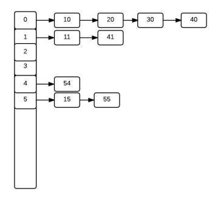

## 해시 충돌
해시 함수가 서로 다른 두개의 입력값에 대해 같은 출력값을 내는 상황

__________________________________
## 해시 충돌 해결: 체이닝(chaining)

* 같은 주소로 해싱되는 원소를 모두 하나의 연결리스트에 매달아서 관리한다.
* 원소를 검색할 때는 해당 연결 리스트의 원소들을 차례로 지나가면서 탐색한다.

## 해시 충돌 해결: 개방 주소 방법(open addressing)
* 체이닝과 달리 어떻게든 주어진 테이블 공간에서 해결한다.
* 따라서 모든 원소가 반드시 자신의 해시값과 일치하는 주소에 저장된다는 보장이 없다.
* 선형 조사(linear probing), 이차원 조사(quadratic probing), 더블 해싱(double hashing)

### 선형 조사(linear probing)
* 가장 간단한 충돌 해결 방법
* 충돌이 일어난 자리에서 i에 관한 일차 함수의 보폭으로 점프한다.
* h_i(x)는 h(x)에서 i만큼 떨어진 자리이다.
* 테이블의 경계를 넘어갈 경우에는 맨 앞으로 돌아간다.

### 이차원 조사(quadratic probing)
* 바로 뒷자리를 보는 대신 보폭을 이차 함수로 넓혀가면서 본다.
* 예를 들어, i번재 해시 함수를 h(x)에서 i^2 만큼 떨어진 자리로 삼는다.
* 즉, h(x), h(x) + 1, h(x) + 4, h(x) + 9, h(x) + 16, ...
* 특정 영역에 원소가 몰려도 그 영역을 빨리 벗어날 수 있다.

### 더블 해싱(double 해싱)
* 두개의 함수를 사용한다.
* 하나의 함수는 최초의 해시값을 얻을 때, 다른 하나의 함수는 해시 충돌이 일어났을 때 이동할 폭을 얻을 때 사용한다.
* 두 원소의 첫번째 해시값이 같더라도 두번째 해시값까지 같을 확률은 매우 작으므로 서로 다른 보폭으로 점프를 하게 된다.
_________________________________________________
## 해시함수의 특징
* 같은 입력값에 대해서 같은 출력값이 보장된다.
* 서로 다른 입력값으로부터 동일한 출력값이 나올 가능성이 희박하므로 입력값에 대한 무결성이 보장된다.
* 일방향성을 갖는다. 해시코드에서 원래 값을 찾는 것은 불가능하다.
_______________________
## Secure Hash Algorithm(SHA)
* NSA(미국 국가안보국)에 의해 1933년 처음 개발된 해시 알고리즘
* 현재 주로 사용되는 것은 SHA-2 함수군으로, 다이제스트의 길이에 따라 SHA-256, SHA-512 등으로 나뉜다.
* SHA-0, SHA-1까지는 해시 충돌성이 존재하지만, SHA-256, SHA-512는 해시 충돌성이 사실상 0에 수렴한다.
* 256의 의미: 해싱을 하면 2^256개의 해시값 중 하나가 나타난다.
__________________________
## 해시의 응용
* 무결성 검사 - 파일 변조 감지
* 클라우드 스토리지에서 동일한 파일 식별 및 수정된 파일 검출
* 데이터베이스에 비밀번호를 저장할 때 사용
* 블록체인
* Git

## 참고자료
* https://www.baeldung.com/java-hashcode
* https://www.youtube.com/watch?v=Rpbj6jMYKag
