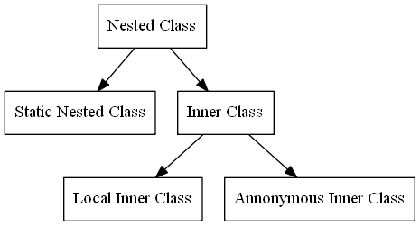

# 클래스 안의 클래스
* 클래스 안의 클래스 : Nested 클래스
## Nested 클래스를 사용하는 이유
* 한 곳에서만 사용되는 클래스를 논리적으로 묶어서 처리할 필요가 있을 때
* 캡슐화가 필요할 때
* 소스의 가독성과 유지보수성을 높이고 싶을 때
## Nested 클래스의 분류

## 익명 클래스의 장점
* 클래스 생성을 줄이기 때문에 메모리를 덜 사용한다.
## 코드 예시
[code](./code/innerClass/) 
