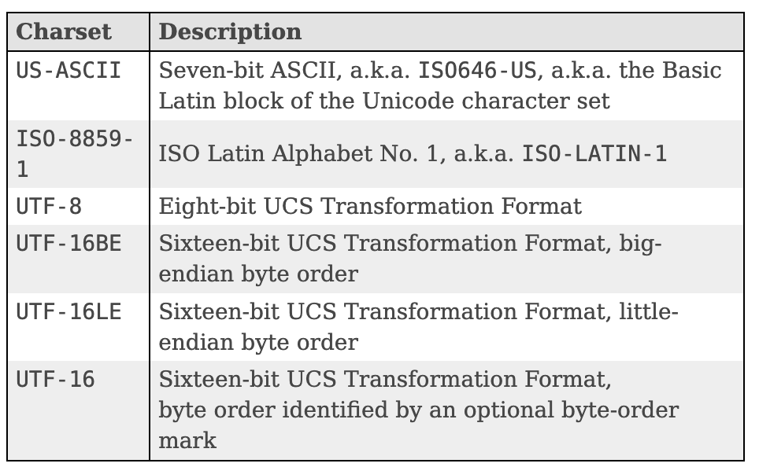

# String

## String 클래스
* String 클래스의 선언부
```java
public final class String
    implements java.io.Serializable, Comparable<String>, CharSequence
```
    * public final : 어디서든 접근 가능, 클래스 확장 불가
    * implements java.io.Serializable, Comparable<String>, CharSequence :
        * Serializable : 해당 객체를 파일로 저장하거나 다른 서버에 전송 가능한 상태가 된다.
        * Comparable : 객체의 순서를 처리
        * CharSequence : 문자열을 다루기 위한 클래스임을 명시
* 디코딩은 일반적으로 암호화되어 있거나 컴퓨터가 이해할 수 있는 값들을 알아보기 쉽게 변환하는 것

## String 문자열을 byte로 변환하기
### UCS(Unicode Character Set)

https://docs.oracle.com/en/java/javase/11/docs/api/java.base/java/nio/charset/Charset.html
* 요즘에는 UTF-16 많이 사용

## null
객체가 null이라는 것은 객체가 아무런 초기화가 되어 있지 않으며, 클래스에 선언되어 있는 어떤 메소드 사용할 수 없음을 의미

## String "==" 과 equals()
```java
String text = "Check value";
String text2 = "Check value";
boolean isSame = (text == text2);
```
* 위의 코드에서 isSame은 true로 나온다.
* 그 이유는 자바에 Constant Pool이라는 것이 존재하기 때문이다. 자바에서는 객체들을 재사용하기 위해서 Constant Pool이라는 것이 만들어져 있고, String의 경우 동일한 값을 갖는 객체가 있으면, 이미 만든 객체를 재사용한다.

## String valueOf() vs String toString()
null인 객체가 들어왔을 때
* valueOf() : null 문자열 리턴 
* toString() : NullPointerException 발생

## String VS StringBuffer VS StringBuilder
### String
* String은 immutable한 객체다. 한 번 만들어지면 더 이상 그 값을 바꿀 수 없다.
* 계속 하나의 String을 만들어 계속 더하는 작업을 한다면, 기존 String 객체는 더 이상 사용할 수 없고 Garbage Collection의 대상이 된다.
### StringBuffer, StringBuilder
* StringBuffer와 StringBuilder는 문자열을 더하더라도 새로운 객체를 생성하지 않는다.
* StringBuffer : Thread safe
* StringBuilder : Thread safe 하지 않음
* 여러 쓰레드에서 인스턴스 변수에 동시에 접근하는 일이 있을 경우 StringBuffer를 사용해야 한다.
* JDK 5 이상에서는 String 더하기 연산을 할 경우, 컴파일할 때 자동으로 해당 연산을 StringBuilder로 변환해 준다.

