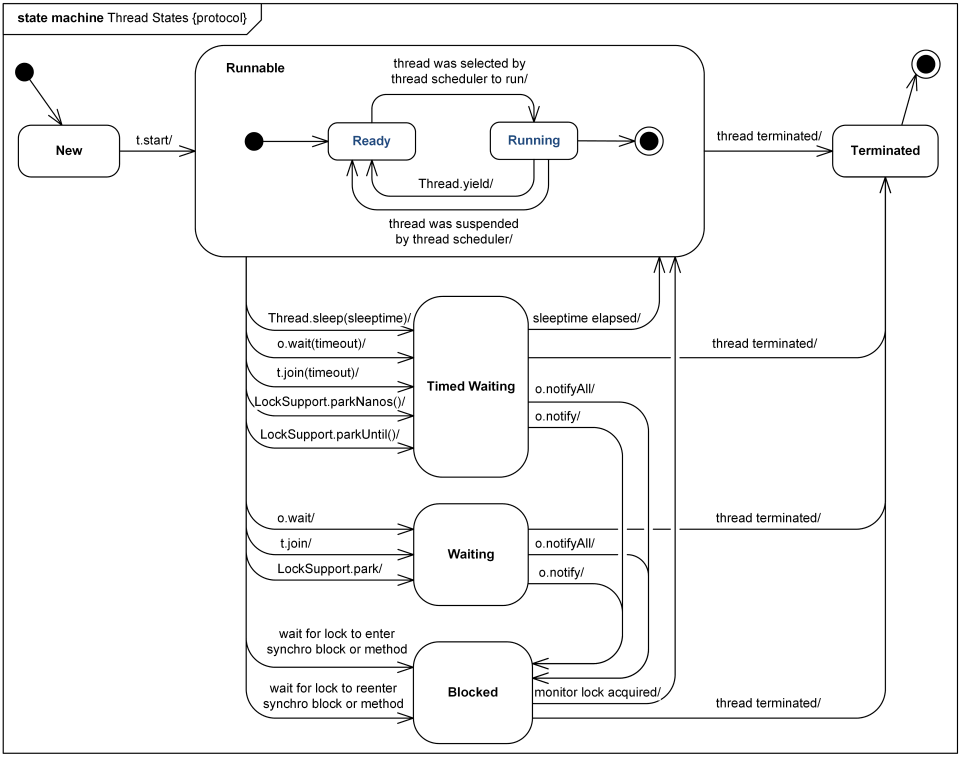

# 쓰레드
## 쓰레드의 장점
* 프로세스 하나를 생성할 때보다 메모리를 적게 점유한다.
* 멀티 코어 프로세서일 경우, 단일 쓰레드로 실행할 때보다 다중 쓰레드로 실행할 때 빠르다.

## 쓰레드 생성
### Java에서 쓰레드 생성하는 방법
* Runnable 인터페이스 사용
* Thread 클래스 사용
* 쓰레드가 수행되는 직접 구현한 메소드는 run() 메소드다.
* 쓰레드를 시작하는 메소드는 start()이다.
* start() 메소드를 통해서 시작했다는 것은 프로세스가 아닌 하나의 쓰레드를 JVM에 추가하여 실행하는 것이다.
* 생성한 쓰레드는 run() 메소드가 종료되면 끝난다.

* 쓰레드가 생성될 때마다 별도의 스택이 할당된다.
https://docs.oracle.com/javase/specs/jls/se11/html/index.html

### Runnable 인터페이스 사용, Thread 클래스 사용 두가지 방법을 제공하는 이유
* 자바에서는 하나의 클래스만 확장할 수 있기 때문이다
    * 어떤 클래스가 다른 클래스를 확장해야 하는 상황인데, 다른 클래스는 Thread를 확장하지 않았고, 쓰레드로 구현해야 한다면, 다중 상속이 불가능하므로 Runnable 인터페이스를 구현해서 사용하면 된다.
* 쓰레드 클래스가 다른 클래스를 확장할 필요가 있을 경우, Runnable 인터페이스를 구현하면 되며, 그렇지 않은 경우에는 쓰레드 클래스를 사용하는 것이 편하다.

### sleep
* Thread에 있는 static 메소드는 대부분 해당 쓰레드를 위해서 존재하는 것이 아니라, JVM에 있는 쓰레드를 관리하기 위한 용도로 사용된다.
* sleep(long mills) : 매개 변수로 넘어온 시간(1/1000초) 만큼 대기한다.
* 데몬 쓰레드를 제외하면, 쓰레드가 종료되지 않으면 해당 자바 프로세스는 끝나지 않는다.

### 쓰레드의 우선 순위
* 대기하고 있는 상황에서 더 먼저 수행할 수 있는 순위

### 데몬 쓰레드(Deemon Thread)
* 데몬 쓰레드가 아닌 사용자 쓰레드는 JVM이 해당 쓰레드가 끝날 때까지 기다린다.
* 데몬 쓰레드는 해당 쓰레드가 종료되지 않아도 다른 실행 중인 일반 쓰레드가 없다면 멈춰 버린다.
* 모니터링과 같이 부가적인 작업을 수행하는 쓰레드를 선언할 때 데몬 쓰레드로 만든다.

## synchronized
* 쓰레드가 안전함을 보장할 때 사용

### synchronized 사용 방법
* 메소드 자체를 synchronized로 선언하는 방법(synchronized methods)
    * 같은 객체를 참조할 때에만 유효하다.
* 다른 하나는 메소드 내의 특정 문장만 synchronized로 감싸는 방법(synchronized statements)

## 쓰레드 상태를 통제하는 메소드
| 리턴 타입 | 메소드 이름 및 매개 변수 | 설명 |
| --------- | ------------- | ------- |
| Thread.state | getState() | 쓰레드 상태를 확인 |
| void | join() | 수행 중인 쓰레드가 중지할 때까지 대기 |
| void | interrupt() | 수행 중인 쓰레드에 중지 요청 |

### 쓰레드 상태
| 상태 | 의미 |
| -------- | -------- |
| NEW | 쓰레드 객체는 생성되었지만, 아직 시작되지는 않은 상태 |
| RUNNABLE | 쓰레드가 실행중인 상태 |
| BLOCKED | 쓰레드가 실행 중지 상태이며, 모니터 락(monitor lock)이 풀리기를 기다리는 상태 |
| WAITING | 쓰레드가 대기 중인 상태 |
| TIMED_WAITING | 특정 시간만큼 쓰레드가 대기 중인 상태 |
| TERMINATED | 쓰레드가 종료된 상태 |
* 쓰레드는 NEW -> 상태 -> TERMINATED의 라이프 사이클을 가진다.

### interrupt()
* interrupt() 메소드는 현재 수행 중인 쓰레드를 InterruptedException을 발생시키면서 중단시킨다.
* 쓰레드가 시작하기 전이나, 종료된 상태에 interrupt() 메소드를 호출하면 예외나 에러 없이 다음 문장으로 넘어간다.

## Object 클래스에 선언된 쓰레드 관련 메소드들
| 리턴 타입 | 메소드 이름 및 매개 변수 | 설명 |
| --------- | ------------- | ------- |
| void | wait() | 다른 쓰레드가 Object 객체에 대한 notify() 메소드나 notifyAll() 메소드를 호출할 때까지 현재 쓰레드가 대기하고 있도록 한다. |
| void | wait(long timeout) | 매개 변수에 지정한 시간만큼 대기. 매개 변수 시간을 넘어서면 현재 쓰레드는 다시 깨어남 |
| void | notify() | Object 객체의 모니터에 대기하고 있는 단일 쓰레드를 깨운다. |
| void | notifyAll() | Object 객체의 모니터에 대기하고 있는 모든 쓰레드를 깨운다. |

## 참고사항
* 쓰레드와 프로세스 차이
* JSP와 Servlet
