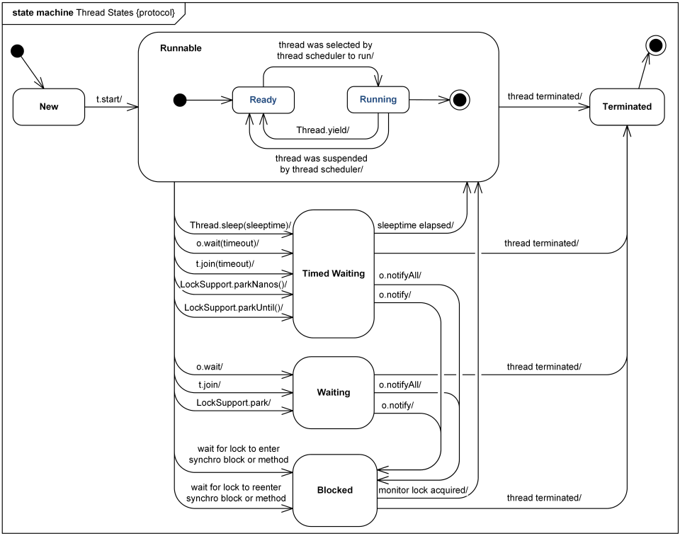

# 쓰레드
## 쓰레드의 장점
* 프로세스 하나를 생성할 때보다 메모리를 적게 점유한다.
* 멀티 코어 프로세서일 경우, 단일 쓰레드로 실행할 때보다 다중 쓰레드로 실행할 때 빠르다.

## 쓰레드 생성
### Java에서 쓰레드 생성하는 방법
* Runnable 인터페이스 사용
* Thread 클래스 사용
* 쓰레드가 수행되는 직접 구현한 메소드는 run() 메소드다.
* 쓰레드를 시작하는 메소드는 start()이다.
* start() 메소드를 통해서 시작했다는 것은 프로세스가 아닌 하나의 쓰레드를 JVM에 추가하여 실행하는 것이다.
* 생성한 쓰레드는 run() 메소드가 종료되면 끝난다.

* 쓰레드가 생성될 때마다 별도의 스택이 할당된다.
https://docs.oracle.com/javase/specs/jls/se11/html/index.html

### Runnable 인터페이스 사용, Thread 클래스 사용 두가지 방법을 제공하는 이유
* 자바에서는 하나의 클래스만 확장할 수 있기 때문이다
    * 어떤 클래스가 다른 클래스를 확장해야 하는 상황인데, 다른 클래스는 Thread를 확장하지 않았고, 쓰레드로 구현해야 한다면, 다중 상속이 불가능하므로 Runnable 인터페이스를 구현해서 사용하면 된다.
* 쓰레드 클래스가 다른 클래스를 확장할 필요가 있을 경우, Runnable 인터페이스를 구현하면 되며, 그렇지 않은 경우에는 쓰레드 클래스를 사용하는 것이 편하다.

### sleep
* Thread에 있는 static 메소드는 대부분 해당 쓰레드를 위해서 존재하는 것이 아니라, JVM에 있는 쓰레드를 관리하기 위한 용도로 사용된다.
* sleep(long mills) : 매개 변수로 넘어온 시간(1/1000초) 만큼 대기한다.
    * Thread의 정적 메소드 : 쓰레드 인스턴스에서 호출되도 결국 정적 메소드가 호출되기 때문에 현재 실행중인 쓰레드가 잠들어 버린다.
    * 주어진 밀리초 동안 해당 쓰레드를 멈춤
* 데몬 쓰레드를 제외하면, 쓰레드가 종료되지 않으면 해당 자바 프로세스는 끝나지 않는다.

### 쓰레드의 우선 순위
* 대기하고 있는 상황에서 더 먼저 수행할 수 있는 순위
* 쓰레드의 우선순위는 운영체제에서 결정권이 있기 때문에 자바 코드 상 설정이 강제되진 않는다. 

### 데몬 쓰레드(Deemon Thread)
* 데몬 쓰레드가 아닌 사용자 쓰레드는 JVM이 해당 쓰레드가 끝날 때까지 기다린다.
* 데몬 쓰레드는 해당 쓰레드가 종료되지 않아도 다른 실행 중인 일반 쓰레드가 없다면 멈춰 버린다.
* 모니터링과 같이 부가적인 작업을 수행하는 쓰레드를 선언할 때 데몬 쓰레드로 만든다.

## synchronized
* 쓰레드가 안전함을 보장할 때 사용

### synchronized 사용 방법
* 메소드 자체를 synchronized로 선언하는 방법(synchronized methods)
    * 같은 객체를 참조할 때에만 유효하다.
* 다른 하나는 메소드 내의 특정 문장만 synchronized로 감싸는 방법(synchronized statements)

## 쓰레드 상태를 통제하는 메소드
| 리턴 타입 | 메소드 이름 및 매개 변수 | 설명 |
| --------- | ------------- | ------- |
| Thread.state | getState() | 쓰레드 상태를 확인 |
| void | join() | 수행 중인 쓰레드가 중지할 때까지 대기 |
| void | interrupt() | 수행 중인 쓰레드에 중지 요청 |

### 쓰레드 상태
| 상태 | 의미 |
| -------- | -------- |
| NEW | 쓰레드 객체는 생성되었지만, 아직 시작되지는 않은 상태 |
| RUNNABLE | 쓰레드가 실행중인 상태 |
| BLOCKED | 쓰레드가 실행 중지 상태이며, 모니터 락(monitor lock)이 풀리기를 기다리는 상태 |
| WAITING | 쓰레드가 대기 중인 상태 |
| TIMED_WAITING | 특정 시간만큼 쓰레드가 대기 중인 상태 |
| TERMINATED | 쓰레드가 종료된 상태 |
* 쓰레드는 NEW -> 상태 -> TERMINATED의 라이프 사이클을 가진다.



### interrupt()
* interrupt() 메소드는 현재 수행 중인 쓰레드를 InterruptedException을 발생시키면서 중단시킨다.
    * 해당 쓰레드의 run에 InterruptedException 발생시킴
	    - sleep 등에 의해 정지 상태에 있을 때
	* sleep 메소드가 해당 예외를 던지는 이유
        - 강제하는 것이 아니라 메시지를 던지는 것
        - 해당 쓰레드에서 받아주어야 함
* 쓰레드가 시작하기 전이나, 종료된 상태에 interrupt() 메소드를 호출하면 예외나 에러 없이 다음 문장으로 넘어간다.

## Object 클래스에 선언된 쓰레드 관련 메소드들
| 리턴 타입 | 메소드 이름 및 매개 변수 | 설명 |
| --------- | ------------- | ------- |
| void | wait() | 다른 쓰레드가 Object 객체에 대한 notify() 메소드나 notifyAll() 메소드를 호출할 때까지 현재 쓰레드가 대기하고 있도록 한다. |
| void | wait(long timeout) | 매개 변수에 지정한 시간만큼 대기. 매개 변수 시간을 넘어서면 현재 쓰레드는 다시 깨어남 |
| void | notify() | Object 객체의 모니터에 대기하고 있는 단일 쓰레드를 깨운다. |
| void | notifyAll() | Object 객체의 모니터에 대기하고 있는 모든 쓰레드를 깨운다. |
* wait() 메소드가 호출되면, 쓰레드 상태는 WAITING 상태가 된다.
* 어떤 주체가 WAITING 상태의 쓰레드를 깨워줘야만 WAITING 상태에서 풀린다.
* interrupt() 메소드를 호출하면 대기 상태에서 풀려날 수도 있지만 InterruptedException이 발생한다.
* notify() 메소드를 호출해서 대기상태를 풀어야 InterruptedException도 발생하지 않고, wait() 이후의 문장도 정상적으로 수행하게 된다.

## ThreadGroup
* ThreadGroup : 쓰레드 관리를 용이하게 하기 위한 클래스, 용도가 다른 여러 쓰레드를 관리한다.
* 쓰레드 그룹은 트리 구조를 가진다.

## ThreadLocal

## volatile
* volatile 변수에 대한 읽기 및 쓰기 작업은 어떻게 동작하나요?
volatile 변수는 읽기 및 쓰기 작업은 즉시 메인 메모리에서 읽어오고 저장하는 방식으로 동작합니다. 스레드가 변경한 값을 즉시 메인 메모리에 기록하기에 CPU 캐시에만 변경된 값이 쓰여 다른 스레드가 변수의 최신 값을 볼 수 없는 문제, 즉 가시성 문제를 해결할 수 있습니다.

* 아래의 코드는 volatile 변수를 사용했지만 Counter 클래스는 완벽한 동기화가 제공이 되지 않습니다. 이유가 무엇일까요~?
한 스레드가 공유변수 메인 메모리에서 count를 읽고 추가 연산을 해 다시 공유변수에 변경된 값을 저장하는 사이에 다른 스레드가 공유변수에 접근해  값을 읽고 변경할 수 있기 때문입니다. count를 하나 증가시키는 작업은 기존의 값을 읽고, 연산을 수행하고, 수행 결과를 쓰는 세가지 작업으로 나눠져 있기에 원자성이 보장되지 않고, volatile은 상호 배제 락을 지원하지 않기에 다른 쓰레드의 접근이 가능하게 됩니다.

```
public class Counter {
    private volatile int count = 0;

    public void increment() {
        count++;
    }

    public int getCount() {
        return count;
    }
}
```


### 메모리 일관성

___________________________________
## 참고사항
### 쓰레드와 프로세스 차이
* 프로세스 process
    * 각 프로그램마다 진행
    * 각각 메모리 공간을 할당 받음
        * 코드, 데이터, 기타 시스템 자원
        * 기본적으로 프로세스 간 공유되지 않음
    * 생성 시 비교적 많은 시간과 메모리 소모
    * 종료 시 프로그램 종료
* 쓰레드 thread
    * 한 프로세스 안에 여러 개 생성되어 진행될 수 있음
    * 프로세스 내의 자원을 여러 쓰레드가 공유
    * 프로세스보다 생성 부담이 적음

* JSP와 Servlet

* [이펙티브 자바 : 공유 중인 가변 데이터와 스레드 동기화](../Java/effective_Java/item78_thread_synchronization.md)

## 참고자료
https://docs.oracle.com/javase/tutorial/essential/concurrency/sync.html
https://docs.oracle.com/javase/8/docs/api/java/util/concurrent/package-summary.html#MemoryVisibility
https://junghyungil.tistory.com/99
https://programmer-chocho.tistory.com/82#:~:text=Java%EC%9D%98%20volatile%20%ED%82%A4%EC%9B%8C%EB%93%9C%EB%8A%94,%EB%A9%94%EC%9D%B8%20%EB%A9%94%EB%AA%A8%EB%A6%AC%EC%97%90%20%EA%B8%B0%EB%A1%9D%EB%90%9C%EB%8B%A4.


