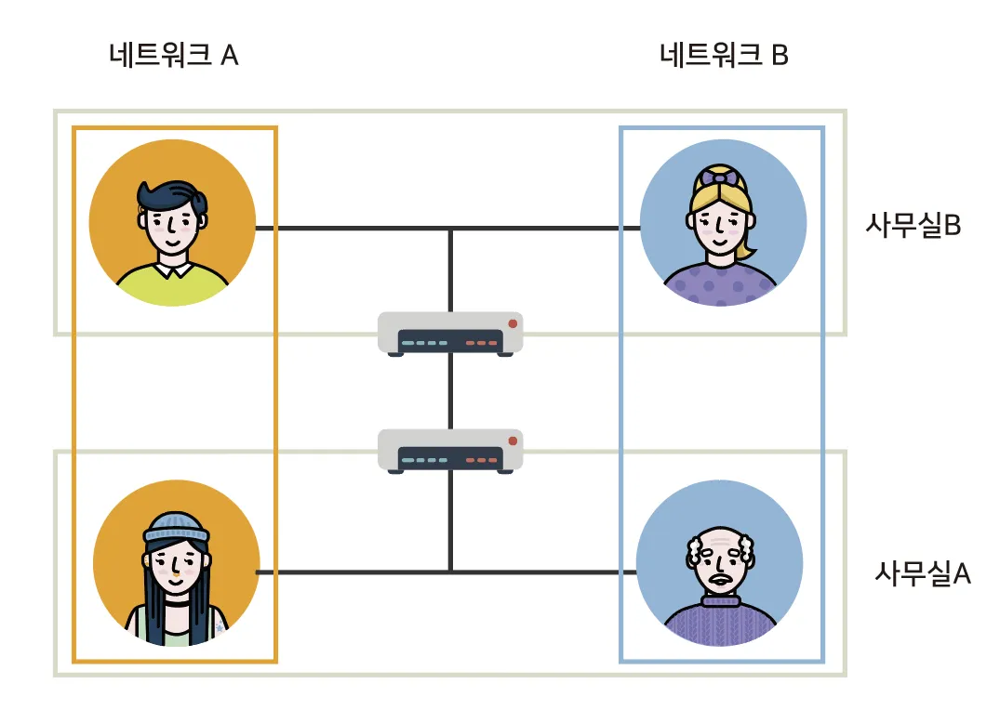

## VPN(Virtual Private Network)
* VPN : 가상 사설망

* VPN은 물리적으로 같은 네트워크인 A와 B를 논리적으로 다른 네트워크인로 분리할 수 있다.

## VPC(Virtual Private Cloud)
* VPC가 없다면 EC2 인스턴스들이 서로 거미줄처럼 연결되고 인터넷과 연결된다.
* 이런 구조는 시스템의 복잡도를 엄청나게 끌어올릴뿐만 아니라 하나의 인스턴스만 추가되도 모든 인스턴스를 수정해야하는 불편함이 생긴다.

* VPC를 적용하면 VPC별로 네트워크를 구성할 수 있고 각각의 VPC에따라 다르게 네트워크 설정을 줄 수 있다.
* 또한 각각의 VPC는 완전히 독립된 네트워크처럼 작동하게 된다.

## VPC를 구축하는 과정
* VPC를 구축하기위해서는 VPC의 IP 범위를 RFC1918이라는 사설 IP 대역에 맞추어 구축해야 한다.

* 한번 설정된 IP 대역은 수정할 수 없으며 각 VPC는 하나의 지역(region)에 종속된다. 
* 각각의 VPC는 완전히 독립적이기때문에 VPC간 통신을 하려면 VPC 피어링(peering) 서비스를 이용해야 한다.

[공인 IP VS 사설 IP]
- 공인 IP : 인터넷 사용자의 로컬 네트워크를 식별하기 위해 ISP(Internet Service Provider, 인터넷 서비스 공급자)가  제공하는 IP주소
- 사설 IP : 일반 가정이나 회사 내 등에 할당된 네트워크의 IP주소
    * IPv4의 주소부족으로 인해 서브넷팅된 IP
    * 라우터에 의해 로컬 네트워크 상의 PC나 장치에 할당
    * 외부에는 공개되지 않아서 외부에서 검색, 접근이 불가능한 IP

* 공인 IP 대역
    * 0.0.0.0 ~ 127.255.255.255
    * 128.0.0.0 ~ 191.255.255.255
    * 192.0.0.0 ~ 233.255.255.255
    * 224.0.0.0 ~ 239.255.255.255
    * 240.0.0.0 ~ 255.255.255.255
* 사설 IP 대역
    * 10.0.0.0 ~ 10.255.255.255
    * 172.16.0.0 ~ 172.31.255.255
    * 192.168.0.0 ~ 192.168.255.255

## 서브넷
* 서브넷은 VPC를 잘개 쪼개는 과정이다.
* 서브넷은 VPC안에 있는 VPC보다 더 작은단위이기때문에 서브넷 마스크의 bit 수가 커지고 IP 범위는 작아진다.
* 서브넷을 나누는 이유는 더 많은 네트워크망을 만들기 위해서이다.
* 각각의 서브넷은 가용영역안에 존재하며 서브넷안에 RDS(Relational Database Service), EC2와같은 리소스들을 위치시킬 수 있다.

## 라우팅 테이블과 라우터
* 네트워크 요청이 발생하면 데이터는 우선 라우터로 향한다.
* 네트워크 요청은 각각 정의된 라우팅테이블에 따라 작동한다.
* 예를 들면, 서브넷A의 라우팅테이블은 172.31.0.0/16 즉 VPC안의 네트워크 범위를 갖는 네트워크 요청은 로컬에서 찾도록 되어 있다.
* 하지만 그 이외 외부로 통하는 트래픽을 처리할 수 없다.

[라우팅 테이블과 라우터]
* 라우터
    1. 경로 설정 : 데이터 패킷이 출발지부터 목적지까지 갈 수 있는 경로를 검사하고 최적 경로 결정
    2. 스위칭 :  경로 설정이 결정될 경우 데이터 패킷 스위칭 작업을 함
* 라우팅 테이블(Routing table) : 네트워크상의 특정 목적지까지의 거리와 가는 방법등을 명시하고 있는 테이블

## 인터넷 게이트웨이(Gateway)
* 인터넷 게이트웨이는 VPC와 인터넷을 연결해주는 하나의 관문이다.
* 서브넷B의 라우팅테이블은 0.0.0.0/0으로 정의되어 있는데 모든 트래픽에 대하여 IGA(인터넷 게이트웨이) A로 향하라는 뜻이다.
* 라우팅테이블은 가장 먼저 목적지의 주소가 172.31.0.0/16에 매칭되는지를 확인한 후 매칭되지 않는다면 IGA A로 보낸다.
* 인터넷과 연결되어있는 서브넷을 퍼블릭 서브넷, 인터넷과 연결되어 있지 않는 서브넷을 프라이빗 서브넷이라 한다.

## 네트워크 ACL과 보안그룹
* 네트워크 ACL과 보안그룹은 방화벽과 같은 역활을 하며 인바운드 트래픽과 아웃바운드 트래픽 보안정책을 설정할 수 있다.

## NAT 게이트웨이