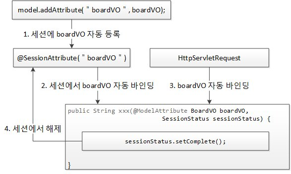

# 부록A. 스프링 MVC를 이용한 게시판 구축

## 1. URL과 @RequestMapping 연결하기
* 웹 상에서 클라이언트의 요청은 모두 URL 기반으로 이뤄진다. 
* 웹 서버는 클라이언트가 요청한 URL 정보를 이용해 서버의 특정 구성 요소에서 서비스를 처리한 후 그 결과를 클라이언트에게 응답으로 보내준다.
* 스프링 MVC에서는 @Controller 어노테이션이 붙은 클래스 안에 @RequestMapping 어노테이션이 붙은 메소드에서 클라이언트 요청을 처리하게 된다.
* @ResponseBody : 메소드에서 반환하는 문자열을 그대로 클라이언트에 전달

### 예시
* 클라이언트가 'http://localhost:8080/mvc/' 라고 URL을 입력하고 웹 서버에 서비스 요청
* 서블릿 컨테이너가 mvc라고 하는 웹 컨텍스트를 찾고 해당 웹 컨텍스트는 스프링 ApplicationContext에게 URL 중에 /를 처리할 수 있는, 즉 @RequestMapping(value ="/")를 가진 메소드에게 처리를 위임


    | 웹 경로 | 의미 |
    | ---- | ---- |
    | http:// | 프로토콜: 규약, 의정서 |
    | localhost | URL(IP): 네트워크 상의 컴퓨터 식별자 |
    | 8080 | 포트 : 컴퓨터에서 구동되고 있는 프로그램 식별자 |
    | /mvc | 컨텍스트 : 프로그램 메뉴 그룹 식별자 |
    | / | 경로 : 메뉴 그룹 중에 메뉴 하나를 식별 |

## 3. VO와 MyBatis를 이용한 DAO 구현


* VO(Value Object) 또는 DTO(Data Transfer Object)
    * VO : 일반적으로 테이블 구조 반영

## 4. 서비스 구현
* DAO :
* 일반적으로 DAO는 데이터베이스 테이블당 하나를 만들게 된다.
* 사용자에게 제공되는 서비스는 여러 테이블의 정보를 조합해서 제공하는 경우가 많다.
* 따라서 하나의 서비스에서 다수의 DAO를 사용하기도 하고 때로는 다수의 서비스가 하나의 DAO를 사용하기도 한다.
* 서비스는 DAO와의 연동뿐만 아니라 서버 기술(웹, 클라이언트/서버)이나 각 벤더별 데이터베이스에 종속되지 않는 로직을 구현하는 곳이다.

## 5. 목록 구현
* MVC에서 모델(Model) : 컨트롤러에서 뷰로 전달해주는 정보
* 스프링 MVC에서 모델을 생성하는 것은 DispatcherServlet의 역할
* DispatcherServlet이 생성한 모델에 대한 참조변수는 @RequestMapping 어노테이션이 붙은 메소드에서 인자를 선언하기만 하면 자동으로 받을 수 있다.

```java
@Controller//C
public class BoardController {
    @Autowired
    private BoardService boardService;

    @RequestMapping(value="/board/list") //URL
    public String list(Model model) {//M
        model.addAttribute("boradList", boardService.list());
        return "/board/list"; // View 힌트 - V
    }
}
```
* MVC 모델 3 요소 : 모델, 뷰 힌트, 컨트롤러
* model.addAttribute() 메소드를 이용해 boardService.list() 메소드의 반환값을 model에 추가하고 있다.
* View 힌트를 이용해 스프링 MVC의 DispatcherServlet은 사용자에게 보여줄 뷰를 선정한다.
* URL과 전혀 다른 뷰 힌트를 사용할 수도 있다.
* View 힌트 앞에 prefix를 붙이고 View 힌트 뒤에 suffix를 붙인 문자열이 최종적으로 파일의 전체 경로가 된다.

## 6. 읽기 구현
* 스프링 MVC에서는 SEO(Search Engine Optimization, 검색 엔진 최적화)에 최적화된 URL을 처리할 수 있는 메커니즘을 제공하는데, 이때 @PathVariable 어노테이션을 사용한다. 

## 7. 새 글 구현
```java
@RequestMapping(value = "/board/write", method=RequestMethod.GET)
public String write(Model model) {
    model.addAttribute("boardVO", new BoardVO());
    return "/board/write";
}

@RequestMapping(value = "/board/write", method=RequestMethod.POST)
public String wrtie(@Valid BoardVO, boardVO, BindingResult bindingResult) {
    if (bindingResult.hasErrors()) {
        return "/board/write";
    } else {
        boardService.write(boardVO);
        return "redirect:/board/list";
    }
}
```
* GET 요청 : BoardVO 인스턴스 생성, MVC 요소 중 모델에 추가
* POST 요청 : BindingResult의 인스턴스를 인자로 받고 있다. BindingResult는 자신의 바로 앞에 있는 인자, 즉 boardVO에 사용자로부터 입력된 값을 바인딩할 때 오류가 발생하는 경우 오류 내용을 자동으로 저장해서 갖고 있게 된다.
* @Valid : 자바에서 지원하는 유효성 검증 기능 JSR-303 자바 규약, 하이버네이트 벨리데이터는 이메일 주소 형식, 신용카드 형식, 안전한 HTML 인지 등등 다양한 검증 기능 제공
* redirect:/board/list : POST 요청을 리다이렉션해서 GET 요청으로 보내는 것, PRG(POST-Redirect-Get) 패턴, View 힌트가 /board/list인 경우 브라우저의 주소는 계속해서 원래 주소로 남아있게 된다. 이때 사용자가 새로 고침 버튼을 누르면 다시 POST 요청이 서버로 전송되고 같은 글이 다시 데이터베이스에 저장된다. PRG 패턴이 적용되면 브라우저 주소가 변경되어서 새로 고침 버튼을 눌러도 서버에 부작용을 일으키지 않는다.
* UTF-8 처리 필터 추가

## 8. 수정 구현
* boardVO에서 자동 바인딩되지 못한 seq와 password는 integer 타입의 속성이 가지는 기본값 0으로 초기화된다.
* 수정화면에서 비밀번호(pwd)에 0을 넣어야만 데이터베이스에 update하는 로직이 실행된다.
* update 문의 where에서 seq와 password를 비교하면 조건에 맞는 로우를 찾을 수 없어 update가 되지 않는다.
* 해결방법 :
    1. 데이터베이스 재조회 : 다른 로직에 비해 부하가 많은 것은 단점이다.
    2. 세션 이용 : 세션도 메모리 자원이기에 객체를 세션에서 더 이상 사용하지 않게 됐을 때는 제거할 필요가 있다.

```java
@Controller
@SessionAttributes("boardVO") // MVC 모델에 추가될 때 세션에도 boardVO 지정
public class BoardController {
    @RequestMapping(value = "/board/edit/{seq}", method = RequestMethod.GET)
    public String edit(@PathVariable int seq, Model model) {
        BoardVO boardVO = boardService.read(seq);
        model.addAttribute("boardVO", boardVO);
        return "/board/edit";
    }

    @RequestMapping(value = "/board/edit/{seq}", method = RequestMethod.POST)
    public String edit(@Valid @ModelAttribute BoardVO boardVO, 
        BindingResult result, int pwd, SessionStatus sessionStatus, Model model) {
        if (result.hasErrors()) {
            return "/board/edit";
        } else {
            if (boardVO.getPassword() == pwd) {
                boardService.edit(boardVO);
                sessionStatus.setComplete();//더이상 필요하지 않은 객체를 세션에서 제거
                return "/redirect:/board/list";
            }
        }
        model.addAttribute("msg", "비밀번호가 일치하지 않습니다.");
        return "/board/edit";
    } 
}
```
* ModelAttribute BoardVO boardVO : HttpServletRequest를 이용해 자동으로 바인딩, @SessionAttributes에서 boardVO가 지정된 경우 세션에 의한 바인딩 먼저 실행되고, 그 후에 HttpServletRequest에 있는 정보로 갱신, HttpServletRequest에 존재하지 않는 속성은 세션에 있는 값을 유지하게 된다.

