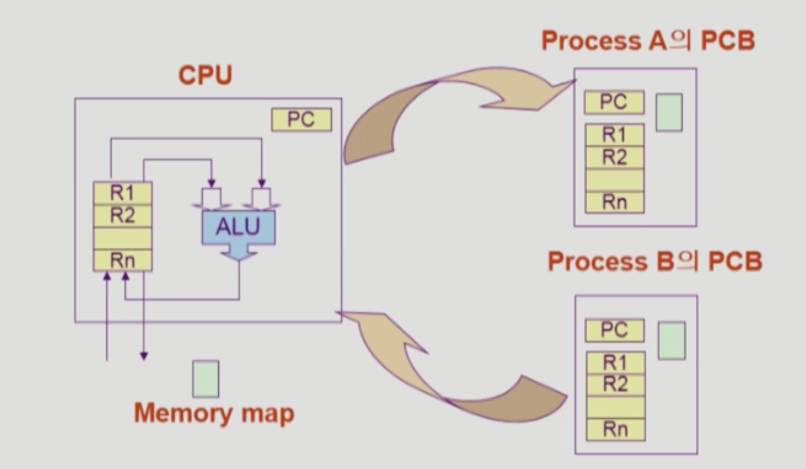
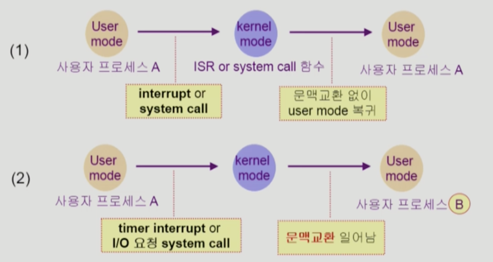

# 프로세스와 스레드
## 문맥 교환 (Context Switch)

- CPU를 한 프로세스에서 다른 프로세스로 넘겨주는 과정
    * CPU 관련 정보 저장
    * 캐시 메모리 flush
- CPU가 다른 프로세스에게 넘어갈 때 운영체제는 다음을 수행
    - CPU를 내어주는 프로세스 상태를 그 프로세스의 PCB에 저장
    - CPU를 새롭게 얻는 프로세스의 상태를 PCB에서 읽어옴
- System call이나 Interrupt 발생 시 반드시 context switch가 일어나는 것은 아님
    - (1)의 경우에도 CPU 수행 정보 등 context의 일부를 PCB에 save해야 하지만 문맥교환을 하는  (2)의 경우 그 부담이 훨씬 큼(eg. cache memory flush : 프로세스가 사용하던 캐시 내역을 지워줘야 함)
    
# 스레드

## 스레드란?
* 프로세스 내부에 CPU 수행 단위가 여러개 있는 경우, CPU 실행의 기본단위를 스레드라 한다.
* 스레드의 구성
    * program counter
    * register set
    * 스택 영역
* 스레드가 동료 스레드와 공유하는 부분(=task)
    * 코드 영역
    * 데이터 영역(스태틱 영역, 메소드 영역)
    * 운영체제 자원들

## 스레드의 이용 장점
- 다중 스레드로 구성된 태스크 구조에서는 하나의 서버 스레드가 blocked(waiting) 상태인 동안에도 동일한 태스크 내의 다른 스레드가 실행(running)되어 빠른 처리를 할 수 있다.
- 동일한 일을 수행하는 다중 스레드가 협력하여 높은 처리율(throughput)과 성능 향상을 얻을 수 있다.
- 스레드를 사용하면 병렬성을 높일 수 있다. (멀티 코어 환경)
    - 각 스레드들이 서로 다른 코어에서 실행

## 쓰레드의 장점
[CPU가 1개 있는 상황에서 적용 가능]

- 응답성(Responsiveness)
    - 사용자 입장에서 빠르다.
    - eg) 멀티 스레드 웹 : 하나의 스레드가 blocked 되어도 (eg. network 이미지 요청) 다른 스레드는 실행될 수 있다.(eg. dislay : 텍스트만 먼저 보여짐)
- 자원 공유(Resource Sharing)
    n개의 쓰레드가 프로세스의 코드, 데이터, 각종 자원을 공유할 수 있다.
- 경제성(Economy)
    - 프로세스에서 문맥 교환은 overhead가 상당히 크나,  스레드는 문맥 교환 overhead 가 작다.
        - 스레드는 동일한 주소 공간을 사용하고 있기 때문에 대부분의 context를 사용할 수 있다.

[CPU가 여러개 있는 상황에서 적용 가능]
- CPU가 여러개 있는 아키텍쳐 (Utilization of MP Architectures)
    - 서로 다른 쓰레드가 다른 processor(CPU)에서 병렬적으로 실행 가능

## 스레드 상태
| 상태 | 열거 상수 | 설명 |
| ------- | ------- | ------- |
| 객체 생성 | NEW |	스레드 객체가 생성, 아직 start() 메소드가 호출되지 않은 상태 |
| 실행 대기	| RUNNABLE | 실행 상태로 언제든지 갈 수 있는 상태 |
| 일시 정지	| WAITING | 다른 스레드가 통지할 때까지 기다리는 상태 |
| 일시 정지 | TIMED_WAITING | 주어진 시간 동안 기다리는 상태 |
| 일시 정지 | BLOCKED |	사용하고자 하는 객체의 락이 풀릴 때까지 기다리는 상태 |
| 종료 | TERMINATED |실행을 마친 상태 |

## 참고자료
* https://happy-coding-day.tistory.com/entry/JAVA-%EB%AA%A8%EB%8B%88%ED%84%B0%EB%9E%80-%EB%AC%B4%EC%97%87%EC%9D%B8%EA%B0%80
