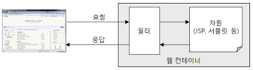
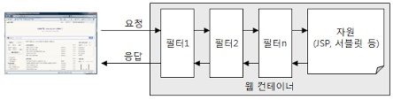

# 필터
필터를 사용하면 JSP/서블릿 등을 실행하기 이전에 요청이 올바른지 또는 자원에 접근할 수 있는 권한을 가졌는지의 여부를 미리 처리할 수 있다.

## 필터란?

* HTTP 요청과 응답을 변경할 수 있는 재사용 가능한 클래스
* 객체의 형태
* 클라이언트에서 오는 요청(request)과 최종 자원(JSP, 서블릿, 기타 자원) 사이에 위치하여 클라이언트 요청 정보를 알맞게 변경할 수 있다.
* 최종 자원과 클라이언트로 가는 응답(response) 사이에 위치하여 최종 자원의 요청 결과를 알맞게 변경

* 클라이언트와 자원 사이에 한개의 필러만 존재할 수 있는 것은 아니며, 여러 개의 필터가 모여 하나의 필터 체인을 형성하게 된다.
* 필터는 흐름도 변경할 수 있다. 즉, 필터는 클라이언트의 요청을 필터 체인의 다음 단계(결과적으로 클라이언트가 요청한 자원)에 보내는 것이 아니라 다른 자원의 결과를 클라이언트에 전송할 수도 있다. (ex. 사용자 인증, 권한 검사)

## 핉터의 구현
* javax.servlet.Filter 인터페이스 : 클라이언트와 최종 자원 사이에 위치하는 필터를 나타내는 객체가 구현해야 하는 인터페이스
* javax.servlet.ServletRequestWrapper 클래스 : 필턱라 요청을 변경한 결과를 저장하는 래퍼
* javax.servlet.ServletResponseWrapper 클래스 : 필터가 응답을 변경하기 위해 사용하는 래퍼

### Filter 인터페이스
[Filter 메소드]
* init : 필터를 초기화할 때 호출된다.
* doFilter : 필터 기능을 수행한다. chain을 이용해서 체인의 다음 필터로 처리를 전달할 수 있다. 서블릿 컨테이너는 사용자가 특정한 자원을 요청했을 때 그 자원 사이에 필터가 존재하는 경우 객체의 doFilter() 메소드를 호출하고 이 시점부터 필터를 적용하기 시작한다. 
* destroy : 필터가 웹 컨테이너에서 삭제될 때 호출된다.

### 요청 및 응답 래퍼 클래스
클라이언트의 요청과 클라이언트로 가는 응답을 변경할 때 사용한다. 서블릿의 요청 래퍼와 응답 래퍼를 만들려면 javax.servlet 패키징레 정의되어 있는 ServletRequestWrapper 클래스와 ServletResponseWrapper 클래스를 상속받아서 구현해야 한다. 하지만 대부분 필터는 HTTP 프로토콜에 대한 요청과 응답을 필터링 하기 때문에 이 두 클래스를 상속받아 알맞게 구현한 HttpServletRequestWrapper 클래스와 HttpServletResponseWrapper 클래스를 상속받아 구현하는 것이 좋다.
___________________________________
## 필터의 응용
보통 다음과 같은 기능에 필터를 적용한다.
1. 사용자 인증
2. 캐싱 필터
3. 자원 접근에 대한 로깅
4. 응답 데이터 변환(HTML 변환, 응답 헤더 변환, 데이터 암호화 등)
5. 공통 기능 실행
