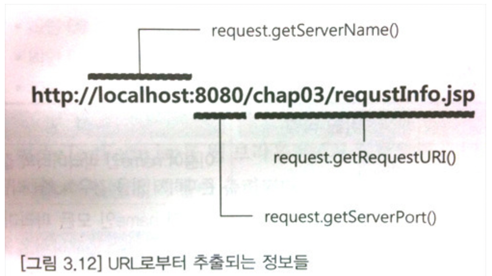
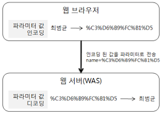
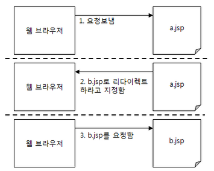
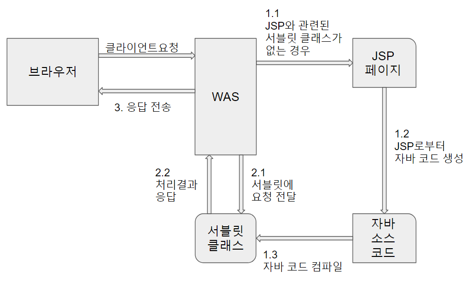

## 스크립트 요소
JSP에서 문서의 내용을 동적으로 생성하기 위해 사용되는 것
______________________________
## request 기본 객체
* request 기본 객체는 JSP 페이지에서 가장 많이 사용되는 기본 객체로서 웹 브라우저의 요청과 관련이 있다.
* 웹 브라우저는 해당 웹서버에 연결한 후 요청 정보를 전송하는데, 이 요청 정보를 제공하는 것이 request 기본 객체이다.

## request 기본 객체가 제공하는 기능
* 클라이언트(웹 브라우저)와 관련된 정보 읽기 기능
* 서버와 관련된 정보 읽기 기능
* 클라이언트가 전송한 요청 파라미터 읽기 기능
* 클라이언트가 전송한 요청 헤더 읽기 기능
* 클라이언트가 전송한 쿠기 읽기 기능
* 속성 처리 기능

1. 클라이언트 정보 및 서버 정보 읽기
* 클라이언트의 IP주소
* 클라이언트가 전송한 요청 정보의 길이
* 클라이언트가 요청 정보를 전송할 때 사용한 캐릭터의 인코딩
* 클라이언트가 요청 정보를 전송할 때 사용한 컨텐츠의 타입
* 클라이언트가 요청한 프로토콜
* 웹 브라우저가 정보를 전송할 때 사용한 방식
* 웹 브라우저가 요청한 URI(URL에서 경로)
* JSP 페이지가 속한 웹 어플리케이션의 컨텍스트 경로
* 연결할 때 사용한 서버 이름
* 서버가 실행중인 포트 번호



## 요청 파라미터 인코딩
* 웹 브라우저는 웹 서버에 파라미터를 전송할 때 알맞은 캐릭터 셋을 이용해서 파라미터 값을 인코딩
* 웹 서버는 알맞은 캐릭터 셋을 이용해서 웹 브라우저가 전송한 파라미터 데이터 디코딩



## 요청 헤더 정보의 처리
* HTTP 프로토콜은 헤더 정보에 부가적인 정보를 담도록 하고 있다.
* 웹 브라우저의 경우 웹 브라우저의 종류, 선호하는 언어에 대한 정보를 헤더에 담아서 전송

______________________________

## response 기본 객체
* 웹 브라우저에 보내는 응답 정보를 담는다.
    * 헤더 정보 입력
        * 웹 브라우저 캐시 제어를 위한 응답 헤더 입력
    * 리다이렉트 하기
    * 웹 브라우저에 쿠키 정보 전송
```
캐시(Cache) : 
- 동일한 데이터를 중복해서 로딩하지 않도록 할 때 사용
- 웹 브라우저는 첫 번째 요청 시 응답 결과를 로컬 PC의 임시 보관소인 캐시에 저장한다. 이후, 동일한 URL에 대한 요청이 있으면 WAS에 접근하지 않고 로컬 PC에 저장된 응답 결과를 사용한다.
- 캐시에 보관된 데이터를 사용하는 경우, WAS에 접근하지 않기 때문에 훨씬 빠르게 응답 결과를 웹 브라우저에 출력할 수 있게 된다.
- 변경이 발생하지 않는 JSP의 응답 결과나 이미지, 정적인 HTML 등은 캐시에 보관함으로써 웹 브라우저의 응답 속도를 향상시킬 수 있다.
```
## 리다이렉트

* 웹 서버가 웹 브라우저에게 다른 페이지로 이동하라고 응답하는 기능

______________________________

## JSP 처리 과정


WAS는 JSP 페이지에 대한 요청이 들어오면 다음과 같은 처리를 한다.
* JSP에 해당하는 서블릿이 존재하지 않을 경우
    * 변환 단계 : JSP 페이지로부터 자바 코드를 생성한다. (1.2)
    * 컴파일 단계 : 자바 코드를 컴파일해서 서블릿 클래스를 생성한다. (1.3)
    * 서블릿에 클라이언트 요청을 전달한다. (2.1)
    * 서블릿이 요청을 처리한 결과를 응답으로 생성한다. (2.2)
    * 응답을 웹 브라우저에 전송한다. (3)
* JSP에 해당하는 서블릿이 존재하는 경우
    * 서블릿에 클라이언트 요청을 전달한다. (2.1)
    * 서블릿이 요청을 처리한 결과를 응답으로 생성한다. (2.2)
    * 응답을 웹 브라우저에 전송한다. (3)

## JSP 페이지 출력 버퍼와 응답
JSP 페이지는 출력 버퍼(buffer)라고 불리는 곳에 임시로 응답 결과를 저장했다가 한 번에 웹 브라우저에 전송한다.

## 출력 버퍼의 장점
1. 데이터 전송 성능 향상
    * 한 번에 큰 단위로 데이터를 전송하는 것이 가능하기 때문이다.
2. JSP 페이지가 생성한 내용이 있다 하더라도 버퍼에 저장된 데이터가 웹 브라우저로 전송되기 전까지는 버퍼에 보관된 데이터를 지우고 새로운 내용을 전송할 수 있다.
    * 에러 페이지 처리 기능 가능
3. 버퍼가 다 차기 전에는 헤더 정보 변경 가능