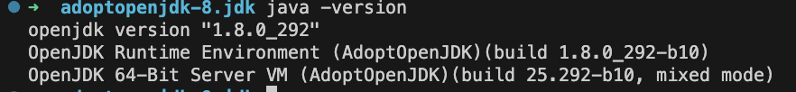
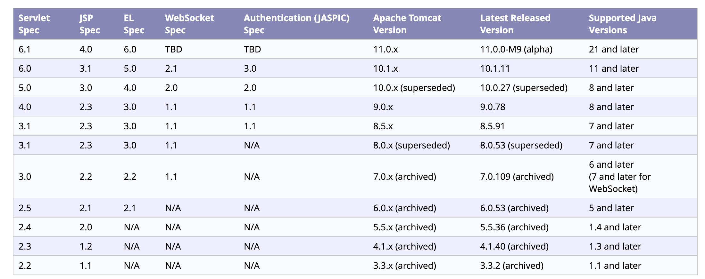
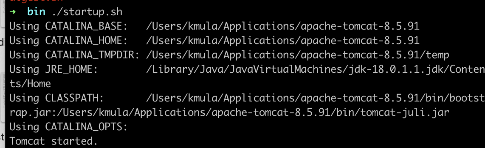
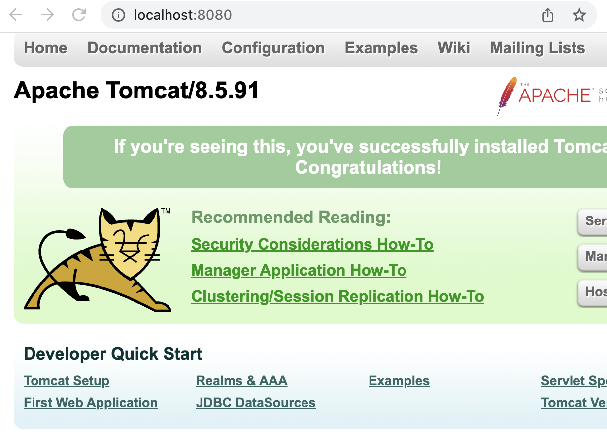
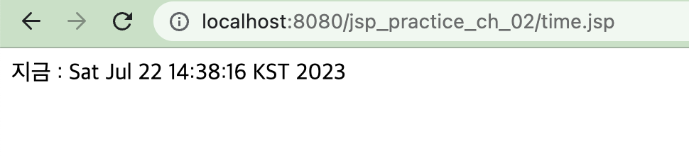
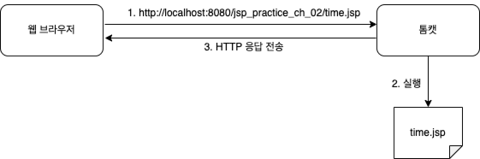

## 사전 세팅
* JDK 8
* 톰캣 8
* MySQL
* IntelliJ
* JSP 2.3
* Servelet 3.1

## 자바 세팅
JAVA_HOME 자바 8버전으로 세팅 완료



## tomcat 설치
* 자바 버전 별로 맞는 톰캣 고르기
    - 

* 톰캣 설치 후 시작
    - 상세 버전은 apache-tomcat-8.5.91으로 했다.

    
* 정상적으로 톰캣 서버가 작동함을 알 수 있음


## JSP 만들어보고 실행
* http://localhost:8080/jsp_practice_ch_02/time.jsp에서 현재 날짜 및 시간 띄우기
* 톰캣이 설치된 경로에서 webapps 디렉토리로 들어간 다음 jsp_practice_ch_02 디렉토리를 만들고 그 다음 time.jsp 파일을 만든다.
* time.jsp
    ```html
    <%@ page contentType="text/html; charset=UTF-8" %>
    <html>
    <head>
    <title>현재 시간</title>
    </head>
    <body>
    지금 : <%=new java.util.Date() %><!-- 스크립트릿 문자열로 생성-->
    </body>
    </html>
    ```
    * 스크립트릿 : JSP 스크립트 요소, 실행할 때마다 JSP가 실행, 스크립트릿을 이용해서 변경되는 부분 생성
* 톰캣 서버를 시작하고 웹브라우저에서 http://localhost:8080/jsp_practice_ch_02/time.jsp에 들어가면 현재 날짜 및 시각이 제대로 나옴을 확인할 수 있다.

    
* time.jsp를 다시 실행하거나 새로 고침을 하면 화면에 표시되는 시간 값이 변경된다.
    * 실행할 때마다 결과가 다르므로 time.jsp는 동적 자원에 해당한다.
    * 실행할 때마다 매번 다른 결과가 표시되는 것은 웹 브라우저에 주소를 입력할 때마다 톰캣이 JSP를 매번 실행하기 때문이다.

        

## 참고자료
* https://velog.io/@moojun3/MacOS-JSP-%EC%8B%A4%EC%8A%B5%ED%99%98%EA%B2%BD-%EA%B5%AC%EC%B6%95tomcat-Intellij
* 자바 버전별 맞는 톰캣 버전 고르기 https://tomcat.apache.org/whichversion.html
* 세팅 시 참고
    * https://m.blog.naver.com/sekhyuni/221035676373
    * https://wisdom-and-record.tistory.com/58
    * https://velog.io/@wijoonwu/%EB%A7%A5%EB%B6%81Mac-OS-M1-%ED%86%B0%EC%BA%A3-%EC%84%A4%EC%B9%98%ED%95%98%EA%B8%B0
    * https://m.blog.naver.com/sekhyuni/221035676373
    * 인텔리제이 얼티메이트 버전 세팅 : https://wisdom-and-record.tistory.com/58 - Java 11이상에서만 지원해서 쓰기 힘들거 같다.


