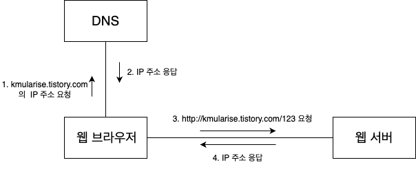

# 웹 기초
## URL

1. 프로토콜 : 웹 브라우저가 서버와 내용을 주고받을 때 사용할 규칙 이름이다. http와 https가 있다.

2. 서버이름 : 웹 페이지를 요청할 서버의 이름을 지정한다. 서버 이름은 "kmularise.tistory.com"와 같은 도메인 이름이나 "211.231.99.250"과 같은 IP주소로 입력할 수 있다.

3. 경로 : 웹 페이지의 상세 주소에 해당하고 웹페이지마다 다른 경로를 갖는다.

4. 쿼리스트링 : 추가로 서버에 보내는 데이터에 해당한다. 같은 경로라 하더라도 입력한 값에 따라 다른 결과를 보여줘야 할 때 쿼리스트링을 사용한다. 

## 웹 브라우저와 웹서버

1. 웹브라우저는 도메인 이름에 해당하는 IP주소를 DNS에 요청
2. DNS IP주소를 응답으로 제공
3. DNS로부터 IP주소를 받으면, 웹브라우저는 IP주소를 이용해서 웹서버에 연결한 뒤 URL에 해당하는 웹페이지를 요청하고 웹페이지를 응답으로 받게 된다.
* DNS(Domain Name Server) : 도메인 이름을 IP 주소로 변환
> *클라이언트와 서버* 
> - 클라이언트 : 요청하는 쪽 
> - 서버 : 서버 : 요청을 받아 알맞은 기능이나 데이터를 제공하는 쪽
> - 웹 브라우저는 HTML 문서나 이미지 등을 요청하므로 클라이언트에 해당하고, 웹 서버는 서버에 해당한다.

## 포트(port)
* IP 주소는 연결할 컴퓨러를 구분하는데 사용되기 때문에, IP 주소만으로는 어떤 서버 프로그램을 실행할지 알 수 없다.
* 각 서버 프로그램은 클라이언트가 연결할 때 다른 서버 프로그램과 구분할 수 있도록 포트를 사용한다.
* 서버 프로그램마다 구분되는 포트 번호를 사용하며 클라이언트는 IP주소와 함께 포트 번호를 사용해서 원하는 서버 프로그램을 연결하게 된다.
* 웹 서버가 사용하는 기본 포트 번호는 80이다. 즉 웹 브라우저는 기본적으로 80 포트를 이용해서 서버에 연결한다.
* 톰캣은 기본적으로 8080 포트를 사용하도록 설정되어 있어, URL에 포트 번호를 붙여 톰캣 서버를 테스트한다.

## HTML
* HTML : HyperText Markup Language
* 렌더링(rendering) : HTML 표준에 따라 HTML 문서로부터 알맞은 화면을 생성하는 과정
    1. 웹서버는 URL에 해당하는 HTML 문서 전송
    2. HTML 문서를 받은 웹 브라우저는 정해진 규칙에 따라 HTML 문서를 분석해서 알맞은 화면을 생성
* HTML 문서는 HTTP 방식을 이용해서 전송한다.

## HTTP
* HTTP : HyperText Transfer Protocol
* 웹 브라우저와 웹 서버가 HTML을 비롯해 이미지, 동영상, XML 문서 등 다양한 데이터를 주고받을 때 사용하는 규칙
* HTTP는 두 가지 관점에서 규칙 정의
    1. 요청 규칙: 웹 브라우저가 웹 서버에 HTML과 같은 것을 요청할 때 사용할 데이터(요청 데이터) 구성 규칙
    2. 응답 규칙: 웹 서버가 웹 브라우저에 HTML과 같은 것을 전송할 때 사용할 데이터(응답 데이터) 구성 규칙
    
    
* HTTP 요청/응답 데이터의 구성 요소

| 구성 요소 | 요청 데이터 | 응답 데이터 |
| ------- | --------------------- | --------------------- |
| start line | GET이나 POST와 같은 HTTP 요청 방식(method)과 요청하는 자원의 경로를 지정한다. | 요청에 대해 200이나 404같은 응답코드를 전송한다. 참고로 200은 요청을 정상적으로 처리했음을 의미한다. |
| HTTP headers | 서버가 응답을 생성하는데 참조할 수 있는 정보를 전송한다. 예를 들어, 브라우저의 종류나 언어 등의 정보를 보낸다. | 응답에 대한 정보를 전송한다. 응답의 바디가 어떤 데이터인지, 길이는 어떻게 되는지 등에 대한 정보를 담는다. |
| body | 정보를 전송해야 할 때 사용한다. 예를 들어 파일 업로드와 같은 기능을 사용하면 바디 영역에 파일을 담아 웹 서버에 전송한다. | 웹 브라우저가 요청한 자원(리소스, resource)의 내용을 담는다. HTML 문서나 이미지 파일 데이터 등이 바디 영역을 이용해서 전달된다. |

## 정적 자원과 동적 자원
* 정적 자원 :
    * 파일이 바뀌지 않는 한 웹 브라우저가 늘 같은 응답 데이터를 받아서 화면에 출력하는 URL에 해당하는 자원
    * 이미지파일이나 HTML 파일이 정적 자원에 해당
* 동적 자원
    * 파일을 바꾸지 않아도 조건에 따라 다른 응답 데이터를 전송하는 URL에 해당하는 자원
    * 시간이나 특정 조건에 따라 응답 데이터가 달라지는 자원
* 정적자원은 캐싱이 가능하고 동적자원은 캐싱이 불가능하다.

## 웹프로그래밍
* 웹 프로그래밍 : 웹 서버가 웹 브라우저에 응답으로 전송할 데이터를 생성해주는 프로그램 작성
    * 네트워크 처리, HTTP 헤더, 파일 입출력 처리 등은 웹서버가 처리한다.
* 웹 서버와 WAS(웹 애플리케이션 서버, Web Application Server)
    * 웹 서버 : 정적인 HTML이나 이미지 제공
    * WAS: 웹을 위한 연결, 프로그래밍 언어, 데이터 베이스 연동과 같이 애플리케이션을 구현하는데 필요한 기능 제공
